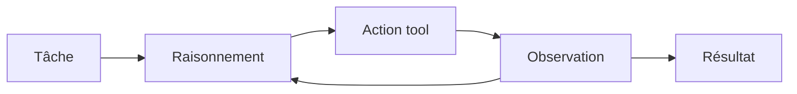
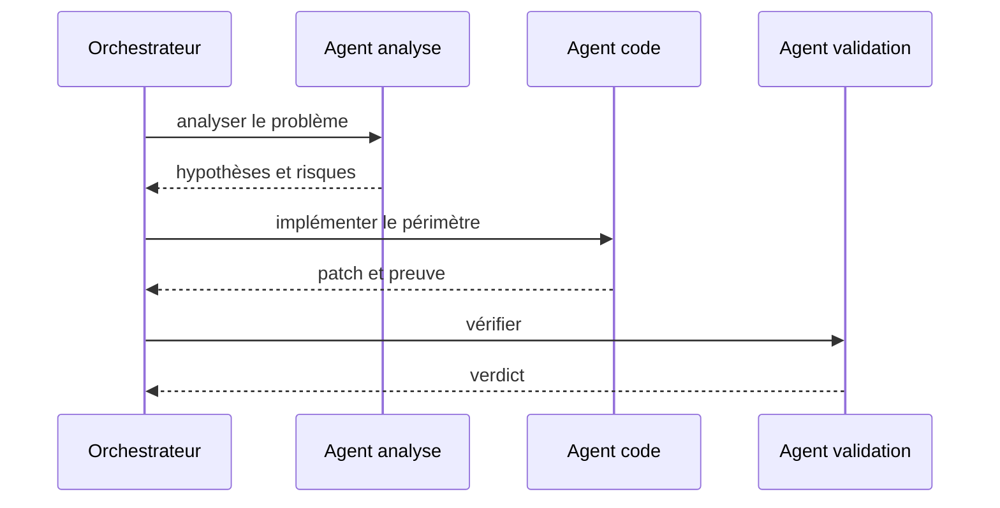
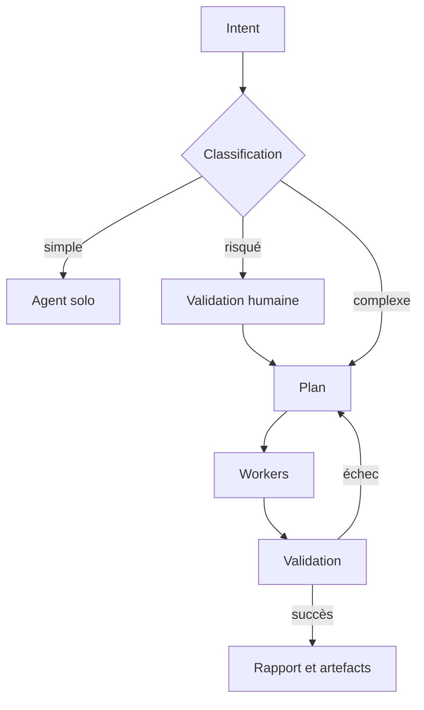

# Rapport 02 - Modèles de pilotage agentique

## Résumé

Le pilotage d'agents se décline en plusieurs modèles. Aucun n'est universel. Le bon choix dépend du niveau d'autonomie, du risque des outils, de la durée de la tâche, du besoin de reprise et du degré de preuve attendu.

Le modèle recommandé pour un vrai projet est hybride :

- un orchestrateur visible ;
- un graphe ou plan d'exécution ;
- des agents spécialisés ;
- des politiques d'outils ;
- une mémoire contrôlée ;
- un système de preuves ;
- une observabilité permanente.

## Typologie principale

| Modèle | Principe | Références | Quand l'utiliser | Risque |
| --- | --- | --- | --- | --- |
| Agent solo outillé | Un agent raisonne, appelle des tools, observe, recommence. | `browser-use`, `Octogent`, `openai-agents-python` | Tâches courtes, périmètre limité, outil sûr. | Dérive si l'état n'est que conversationnel. |
| Skills et instructions | Le host active des compétences spécialisées. | `claude-skills`, `superpowers`, `andrej-karpathy-skills`, `BMAD-METHOD` | Améliorer discipline, style, méthodes, expertise. | Non contraignant sans runtime. |
| Handoff | Un agent transfère une tâche à un agent mieux adapté. | `openai-agents-python`, `agent-framework`, `autogen` | Spécialisation nette, contrat de sortie clair. | Perte de contexte si le transfert est flou. |
| Agent-as-tool | Un agent appelle un autre agent comme un outil borné. | `openai-agents-python`, `autogen`, `kagent` | Encapsuler expertise et limiter autonomie. | Boîte noire si le sous-agent ne produit pas de preuve. |
| Manager hiérarchique | Un manager délègue, suit et valide. | `crewAI`, `ruflo`, `switchboard` | Travail multi-étapes avec rôles distincts. | Sur-orchestration et théâtre agentique. |
| Graphe d'état | Les noeuds représentent décisions, actions, branches, reprises. | `langgraph`, `agent-framework`, `haystack` | Workflows critiques, longs ou répétables. | Complexité de modélisation. |
| Flow visuel | Un builder définit workflow, prompts, tools et API. | `dify`, `langflow` | Prototypage, équipes mixtes, workflows métier. | Logique opaque si non versionnée/testée. |
| Kanban opérateur | L'humain pilote des agents depuis un tableau. | `switchboard`, `beads`, `pixel-agents` | Coordination multi-agent, revue, lots indépendants. | UI sans état causal si mal connectée. |
| Runtime infra | Agents déclarés comme ressources ou workloads. | `kagent`, `agent-sandbox`, `OpenHands`, `openclaw` | Production, multi-utilisateur, actions risquées. | Coût d'exploitation et sécurité. |
| Mémoire et contexte | Le pilotage est enrichi par graphes, recherche, compression. | `mempalace`, `CodeGraphContext`, `graphify`, `LLMLingua`, `beads` | Long contexte, codebase large, multi-session. | Staleness, contamination, perte d'information. |
| Observabilité-first | Le système est piloté par traces, evals, datasets. | `langfuse`, `agent-framework`, `ai-agents-for-beginners` | Industrialiser et améliorer les agents. | Mesurer de mauvaises métriques. |

## Modèle 1 - Agent solo outillé

### Description

L'agent solo suit une boucle :

Ce modèle est simple et puissant. Il devient fragile dès que :

- la tâche dure longtemps ;
- plusieurs fichiers ou systèmes sont modifiés ;
- une approbation humaine est nécessaire ;
- le contexte dépasse la fenêtre utile ;
- le résultat doit être auditable.

### Bon usage

Utiliser ce modèle pour :

- recherche locale ;
- navigation contrôlée ;
- extraction d'information ;
- petite correction de code ;
- génération d'un artefact borné.

### Conditions minimales

- Budget de tools.
- Liste d'actions autorisées.
- Critère de terminaison.
- Trace des appels tools.
- Validation finale.

## Modèle 2 - Skills et instructions

### Description

Les skills activent une méthode ou une expertise. Ce modèle est très efficace pour renforcer les comportements :

- "penser avant de coder" ;
- "préférer les changements chirurgicaux" ;
- "appliquer un format de documentation" ;
- "exécuter une séquence de design puis plan puis implémentation".

### Avantage

Le coût d'adoption est faible. Les skills s'intègrent bien dans des hosts comme Claude Code, Codex, Cursor ou Copilot.

### Défaut

Une skill n'est pas une barrière de sécurité. Si le host ne contrôle pas les tools, l'état et les validations, la skill reste une consigne.

### Règle

Utiliser les skills pour la méthode, pas comme unique runtime de pilotage.

## Modèle 3 - Handoff et agent-as-tool

### Description

Un orchestrateur confie une sous-tâche à un spécialiste :

Le handoff est le modèle le plus pragmatique pour spécialiser sans perdre tout contrôle.

### Bon usage

- Expert juridique, sécurité, UI, test, migration.
- Sous-tâche lisible avec sortie attendue.
- Contexte limité et préparé.
- Validation par l'orchestrateur.

### Défaut

Si l'orchestrateur transmet une consigne floue, le sous-agent amplifie l'ambiguïté. Le handoff doit inclure :

- but ;
- périmètre ;
- fichiers ou systèmes autorisés ;
- sortie attendue ;
- critères de refus ;
- preuve exigée.

## Modèle 4 - Graphe d'état

### Description

Le graphe encode le workflow en noeuds :

LangGraph, Microsoft Agent Framework et Haystack montrent l'intérêt de ce modèle :

- état durable ;
- branches ;
- reprise ;
- instrumentation ;
- contrôle fin des transitions.

### Bon usage

Utiliser quand la tâche est :

- répétable ;
- critique ;
- multi-étapes ;
- auditable ;
- longue ;
- dépendante de plusieurs systèmes.

### Défaut

Le graphe devient lourd si on modélise trop tôt des cas rares. Le bon design commence avec peu de noeuds stables :

- classifier ;
- planifier ;
- exécuter ;
- vérifier ;
- rapporter ;
- escalader.

## Modèle 5 - Crews, swarms et managers

### Description

Ce modèle crée une équipe d'agents avec rôles, responsabilités et coordination. CrewAI, Ruflo, Switchboard et certains systèmes de subagents montrent différentes variantes.

### Avantages

- Bonne spécialisation.
- Parallélisme possible.
- Peut réduire le contexte par rôle.
- Bon alignement avec les organisations humaines.

### Défauts

- Les agents peuvent se contredire.
- Le manager peut devenir une couche de résumé faible.
- Le parallélisme crée des conflits d'écriture.
- Les coûts augmentent vite.
- Les preuves sont souvent moins nettes.

### Règle

Ne lancer plusieurs agents que si les sous-tâches ont des frontières d'écriture et de responsabilité disjointes.

## Modèle 6 - Plateforme visuelle

### Description

Dify, Langflow et Switchboard montrent trois visions :

- builder de workflow ;
- playground/API/MCP ;
- Kanban opérateur pour agents IDE.

### Avantage

Le pilotage devient visible. C'est essentiel pour :

- équipes non spécialistes ;
- revue humaine ;
- opérations ;
- démonstration ;
- monitoring.

### Défaut

Une interface visuelle peut masquer un workflow non robuste. Pour être production-ready, elle doit exposer :

- le graphe versionné ;
- l'état de run ;
- les erreurs ;
- les décisions humaines ;
- les traces ;
- les artefacts ;
- les permissions.

## Modèle 7 - Runtime infra et sandbox

### Description

Kagent, Agent Sandbox, OpenHands et OpenClaw déplacent le pilotage vers l'infrastructure :

- agents déclarés ;
- pods ou sandboxes ;
- identité stable ;
- stockage persistant ;
- RBAC ;
- isolation workspace/session ;
- logs et events.

### Avantage

Ce modèle est le plus adapté aux actions réelles :

- exécution de code ;
- accès réseau ;
- actions browser ;
- intégrations cloud ;
- multi-utilisateur ;
- déploiement.

### Défaut

Il faut gérer les mêmes problèmes qu'une plateforme distribuée :

- identité ;
- secrets ;
- quotas ;
- isolation ;
- nettoyage ;
- audit ;
- reprise ;
- coûts infra.

## Modèle 8 - Mémoire et contexte comme pilotage

### Description

Le contexte n'est pas un simple input. Il pilote directement les décisions de l'agent.

Les dépôts de cette famille montrent plusieurs couches :

- graphe de code ;
- issue graph ;
- mémoire conversationnelle verbatim ;
- KG temporel ;
- compression de prompt ;
- bundles exportables ;
- tags d'incertitude.

### Avantage

Un meilleur contexte réduit :

- hallucinations ;
- recherches répétées ;
- pertes de décisions ;
- coût token ;
- erreurs de fichiers ;
- incohérences multi-session.

### Défaut

Une mémoire mal gouvernée est pire qu'aucune mémoire. Elle peut injecter :

- données périmées ;
- décisions abandonnées ;
- hypothèses non vérifiées ;
- secrets ;
- contenu hostile ;
- conclusions de mauvais agent.

## Modèle 9 - Observabilité comme boucle de pilotage

### Description

Langfuse, OpenTelemetry, les event stores, les évaluations offline/online et les traces de framework transforment l'agent en système mesurable.

### Ce qu'il faut tracer

- intention utilisateur ;
- plan ;
- transitions d'état ;
- prompt et contexte utilisés ;
- modèle appelé ;
- tools appelés ;
- erreurs ;
- coûts ;
- validations humaines ;
- preuves produites ;
- verdict d'évaluation.

### Règle

Un workflow sans trace n'est pas pilotable. Il est seulement observable par anecdote.

## Matrice comparative

| Critère | Prompt/skills | Handoff | Graphe | Crew/swarm | Plateforme infra |
| --- | --- | --- | --- | --- | --- |
| Simplicité | Forte | Moyenne | Moyenne | Faible | Faible |
| Contrôle | Faible seul | Moyen | Fort | Variable | Fort |
| Reprise | Faible | Moyenne | Forte | Variable | Forte |
| Coût | Faible | Moyen | Moyen | Elevé | Elevé |
| Audit | Faible | Moyen | Fort | Variable | Fort |
| Sécurité | Dépend du host | Bonne si borné | Bonne | Risquée sans gates | Forte si RBAC/sandbox |
| Enseignement | Excellent | Bon | Excellent | Moyen | Moyen |
| Production | Insuffisant seul | Bon | Très bon | A valider | Très bon |

## Recommandation de synthèse

Pour créer un vrai projet de pilotage :

1. Commencer par un orchestrateur unique.
2. Modéliser l'état et les transitions.
3. Définir agents et tools comme ressources déclarées.
4. Ajouter handoffs et agents-as-tools avant les swarms.
5. Réserver le parallélisme aux tâches indépendantes.
6. Installer observabilité, preuves et HITL avant les actions risquées.
7. Ajouter mémoire et compression seulement avec tests de non-régression contextuelle.

La bonne architecture n'essaie pas de tout rendre autonome. Elle rend l'autonomie inspectable, limitée et améliorable.

