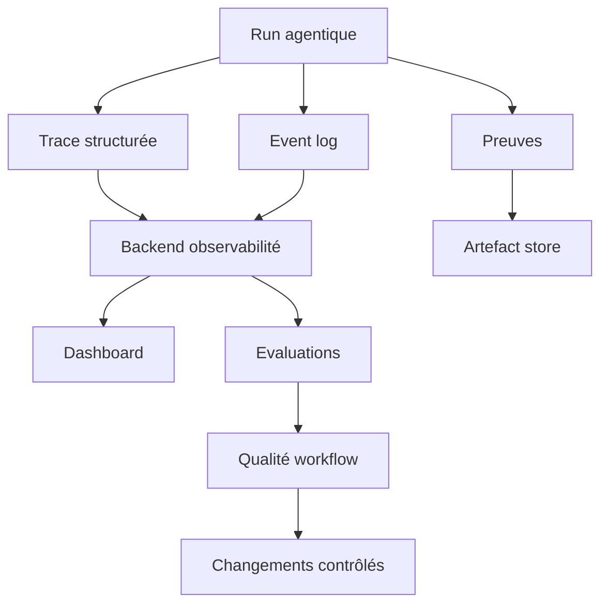

# Rapport 03 - Performance, efficacité et observabilité

## Résumé

Dans un système agentique, la performance ne se limite pas à la latence d'un appel modèle. Elle combine :

- taux de réussite de tâche ;
- coût par tâche terminée ;
- nombre d'itérations ;
- qualité des preuves ;
- sécurité des actions ;
- capacité de reprise ;
- précision du contexte ;
- temps de blocage humain ;
- stabilité multi-session.

Le corpus montre que les systèmes les plus robustes ne cherchent pas seulement à "faire plus vite". Ils cherchent à réduire les boucles inutiles, rendre les décisions visibles, limiter les outils risqués et évaluer chaque workflow.

## Les dimensions de performance

| Dimension | Mesure utile | Pourquoi |
| --- | --- | --- |
| Succès tâche | Tâche réussie avec preuve acceptée | Mesure finale la plus importante. |
| Coût | Tokens, appels modèle, tools, infra | Evite l'autonomie coûteuse et non maîtrisée. |
| Latence | Durée par étape, par tool et par run | Identifie les goulets d'étranglement. |
| Itérations | Nombre de cycles raisonner-agir-observer | Détecte les agents qui tournent en boucle. |
| Qualité contexte | Sources utilisées, rappel, précision, staleness | Réduit les hallucinations et mauvaises modifications. |
| Stabilité | Reprise, rejouabilité, échecs transitoires | Rend les workflows longs exploitables. |
| Sécurité | Blocages policy, approvals, violations | Mesure l'autonomie réelle et son risque. |
| Human-in-the-loop | Demandes, décisions, refus, reprises | Optimise la collaboration humain-agent. |
| Observabilité | Couverture de traces et logs structurés | Permet debug et amélioration. |

## Ce que le corpus montre

### LangGraph : performance par état durable

LangGraph insiste sur les agents stateful long-running, la reprise durable, le HITL, la mémoire et le tracing. Son intérêt performance n'est pas seulement l'exécution. C'est la capacité à ne pas perdre le run, à inspecter l'état, à reprendre et à déboguer.

Le bénéfice réel :

- moins de recommencements ;
- moins de contexte reconstruit à la main ;
- transitions plus lisibles ;
- erreurs localisées par noeud ;
- possibilité d'évaluer des branches précises.

### Microsoft Agent Framework : performance par workflows, middleware et OTel

Agent Framework apporte un angle enterprise :

- orchestration graph-based ;
- multi-langage .NET/Python ;
- middleware ;
- DevUI ;
- OpenTelemetry ;
- workflows séquentiels, concurrents, group chat, handoff.

Ce modèle permet d'instrumenter le runtime lui-même, pas seulement les prompts.

### OpenAI Agents SDK : efficacité par primitives simples

OpenAI Agents SDK est très utile pour un socle pragmatique :

- agents ;
- tools ;
- handoffs ;
- guardrails ;
- HITL ;
- sessions ;
- tracing ;
- sandbox agent.

Le bon usage consiste à garder ces primitives simples et à ajouter un plan externe quand le workflow devient complexe.

### CrewAI : efficacité par spécialisation, risque par autonomie

CrewAI distingue Crews et Flows :

- Crews pour collaboration autonome ;
- Flows pour contrôle événementiel, état et branches ;
- manager hiérarchique pour coordination et validation.

La leçon est importante : les équipes d'agents peuvent être efficaces, mais les Flows donnent un meilleur contrôle quand la qualité doit être reproductible.

### Dify et Langflow : efficacité par conception visuelle

Les builders visuels rendent les workflows accessibles, testables en surface et exposables via API/MCP. Ils sont efficaces pour prototyper et aligner une équipe.

Le risque est de confondre prototype et runtime robuste. Pour la performance durable, il faut :

- versionner la définition du workflow ;
- mesurer chaque noeud ;
- conserver les inputs/outputs ;
- tester les branches ;
- bloquer les tools dangereux ;
- exporter les runs et traces.

### Langfuse : efficacité par instrumentation

Langfuse n'améliore pas directement un agent. Il rend les agents améliorables :

- traces ;
- prompt management ;
- evals ;
- datasets ;
- playground ;
- intégrations framework.

Sans ce type de couche, l'amélioration repose sur impression humaine et anecdotes.

### Mémoire et contexte : efficacité par réduction du bruit

`CodeGraphContext`, `graphify`, `mempalace`, `LLMLingua` et `beads` attaquent un même problème : les agents gaspillent leur budget quand ils cherchent, relisent ou oublient.

Les gains attendus :

- éviter des lectures répétées ;
- fournir une carte de code au lieu d'un tas de fichiers ;
- conserver les décisions ;
- réduire le prompt sans perdre les éléments clés ;
- relier tâches, preuves et dépendances ;
- éviter les conflits entre agents.

La performance contextuelle doit être mesurée. Une compression qui supprime une contrainte critique est une régression, même si elle réduit les tokens.

## Efficacité : ce qui marche vraiment

### 1. Rendre l'état externe au modèle

Un agent sans état externe doit tout maintenir dans le prompt. Cela dégrade :

- reprise ;
- audit ;
- collaboration ;
- correction d'erreurs ;
- gestion des longues tâches.

Les meilleurs signaux du corpus convergent vers un état externe : checkpoint, event store, graph, issue graph, transcript, run state ou CRD.

### 2. Contraindre les tools

L'efficacité chute quand un agent peut appeler n'importe quel outil sans stratégie. Il faut :

- déclarer les tools par rôle ;
- limiter les arguments ;
- valider les sorties ;
- tracer les appels ;
- bloquer actions hors politique ;
- imposer HITL pour les risques.

### 3. Réduire les agents inutiles

Un sous-agent est utile seulement s'il apporte :

- expertise différente ;
- contexte réduit ;
- action isolée ;
- validation indépendante ;
- parallélisme sans conflit.

Sinon, il ajoute coût, latence, résumé et bruit.

### 4. Optimiser le contexte avant le modèle

Changer de modèle ne corrige pas un mauvais contexte. Les meilleures pratiques :

- graphe de code pour les dépendances ;
- recherche sémantique avec sources ;
- bundles de contexte ;
- mémoire par tâche ;
- compression testée ;
- suppression des sources périmées ;
- tags extrait/inféré/ambigu.

### 5. Utiliser le parallélisme avec frontières

Le parallélisme est efficace quand :

- les sous-tâches sont indépendantes ;
- les chemins de fichiers ou ressources sont disjoints ;
- les critères de sortie sont explicites ;
- une étape d'intégration existe ;
- les conflits sont détectés.

Le parallélisme est contre-productif quand plusieurs agents modifient le même contrat sans coordination.

## Métriques recommandées

### Métriques de run

| Métrique | Interprétation |
| --- | --- |
| `run_success_rate` | Proportion de runs acceptés par preuve. |
| `run_abort_rate` | Runs interrompus, bloqués ou rejetés. |
| `steps_per_success` | Efficacité du plan. |
| `tool_calls_per_success` | Complexité réelle de l'exécution. |
| `retry_count` | Fragilité des tools ou du raisonnement. |
| `handoff_count` | Niveau de délégation. |
| `human_approval_count` | Niveau de risque ou d'ambiguïté. |
| `policy_block_count` | Tentatives empêchées par sécurité. |

### Métriques de contexte

| Métrique | Interprétation |
| --- | --- |
| `context_source_count` | Nombre de sources réellement utilisées. |
| `stale_context_hits` | Sources périmées injectées. |
| `retrieval_precision` | Pertinence des éléments récupérés. |
| `retrieval_recall` | Couverture des éléments nécessaires. |
| `compression_loss_failures` | Régressions causées par compression. |
| `memory_correction_count` | Mémoires retirées ou corrigées. |

### Métriques de coût

| Métrique | Interprétation |
| --- | --- |
| `tokens_per_success` | Coût modèle par tâche acceptée. |
| `model_mix_ratio` | Répartition petit/grand modèle. |
| `cache_hit_rate` | Réutilisation du contexte ou résultats. |
| `sandbox_resource_cost` | Coût infra des actions réelles. |

### Métriques de qualité

| Métrique | Interprétation |
| --- | --- |
| `proof_acceptance_rate` | Preuves validées au premier contrôle. |
| `regression_rate` | Tâches qui cassent un comportement existant. |
| `review_findings_per_run` | Bugs détectés en revue. |
| `eval_score_by_node` | Score par étape du workflow. |
| `rollback_count` | Changements annulés ou non retenus. |

## Observabilité minimale

Un run doit produire une trace structurée avec :

- identifiant de run ;
- version du workflow ;
- version des prompts ;
- modèle appelé ;
- contexte injecté ;
- décision de routage ;
- agent responsable ;
- tool appelé ;
- arguments normalisés ;
- sortie résumée ;
- statut ;
- erreur ;
- preuve ;
- décision humaine si présente.

## Architecture d'observabilité

## Evaluation

Un système agentique a besoin de deux types d'évaluation :

### Evaluation offline

Objectif : vérifier le comportement avant exposition.

Jeux de tests recommandés :

- tâches simples ;
- tâches ambiguës ;
- tâches avec contexte incomplet ;
- tâches demandant refus ;
- tâches avec tool interdit ;
- tâches multi-fichiers ;
- tâches nécessitant reprise ;
- tâches avec mémoire contradictoire.

### Evaluation online

Objectif : mesurer l'usage réel.

Données à suivre :

- feedback utilisateur ;
- erreurs non prévues ;
- corrections manuelles ;
- coûts réels ;
- décisions humaines ;
- tendances par type de tâche.

## Optimisation par couche

| Couche | Optimisation prioritaire |
| --- | --- |
| Prompt | Clarifier but, contraintes, sortie, refus. |
| Contexte | Récupérer moins mais mieux, avec sources. |
| Modèle | Router selon risque et complexité. |
| Workflow | Supprimer noeuds inutiles, expliciter branches. |
| Tools | Réduire permissions, valider arguments. |
| Mémoire | Ajouter provenance, expiration, correction. |
| Sandbox | Isoler, réutiliser si sûr, nettoyer. |
| Observabilité | Mesurer par run et par étape. |

## Stratégie de modèles

Le corpus supporte implicitement une stratégie multi-modèle :

- petit modèle pour triage, classification, extraction ;
- modèle fort pour planification risquée, arbitrage, synthèse complexe ;
- modèle spécialisé pour code, vision, navigateur ou sécurité ;
- modèle de compression ou reranking pour contexte.

La règle : ne pas mélanger des modèles sans contrat. Chaque modèle doit avoir :

- rôle ;
- limites ;
- métrique ;
- coût accepté ;
- fallback ;
- trace.

## Performance et sécurité sont liées

Un système plus autonome mais moins sécurisé n'est pas performant. Il déplace le coût vers :

- revue humaine ;
- incidents ;
- rollback ;
- perte de confiance ;
- secrets exposés ;
- état corrompu.

Les contrôles sécurité améliorent aussi l'efficacité :

- allowlists réduisent les explorations inutiles ;
- sandbox limite les effets secondaires ;
- HITL évite les mauvaises actions coûteuses ;
- audit accélère le debug ;
- quotas détectent les boucles.

## Recommandation finale

Pour maximiser performance et efficacité :

1. Instrumenter avant d'optimiser.
2. Evaluer la tâche complète, pas seulement les prompts.
3. Mesurer les preuves acceptées, pas seulement les réponses générées.
4. Réduire le contexte inutile avant d'augmenter le modèle.
5. Ajouter des agents seulement quand ils réduisent la complexité globale.
6. Utiliser le parallélisme uniquement avec frontières claires.
7. Garder les outils puissants derrière politiques, sandbox et approbations.

La performance agentique mature est une propriété du système complet : workflow, contexte, outils, modèles, sécurité, traces et humains.

