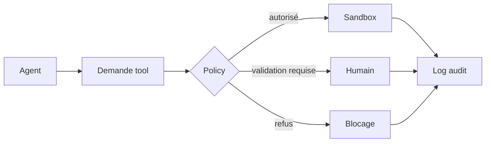

# Rapport 04 - Risques, défauts et anti-patterns

## Résumé

Les systèmes multi-agents échouent rarement à cause d'un seul mauvais prompt. Ils échouent parce que le pilotage n'a pas été matérialisé :

- état absent ;
- outils trop permissifs ;
- mémoire non gouvernée ;
- objectifs flous ;
- validations faibles ;
- agents trop nombreux ;
- traces insuffisantes ;
- UI qui montre une activité sans preuve.

Ce rapport liste les défauts les plus dangereux et les contre-mesures.

## Anti-pattern 1 - Le super-agent maître

### Symptôme

Un prompt décrit un orchestrateur central supposé tout planifier, déléguer, vérifier, mémoriser et sécuriser.

### Pourquoi c'est fragile

Le modèle devient à la fois :

- planner ;
- scheduler ;
- policy engine ;
- mémoire ;
- juge ;
- intégrateur ;
- auditeur.

Ces fonctions doivent être séparées, car elles ont des contraintes différentes.

### Contre-mesure

Externaliser :

- plan ;
- état ;
- permissions ;
- traces ;
- preuves ;
- mémoire ;
- décisions humaines.

L'orchestrateur peut raisonner, mais le système doit porter la vérité opérationnelle.

## Anti-pattern 2 - Trop d'agents trop tôt

### Symptôme

Le projet crée de nombreux rôles : planner, researcher, coder, reviewer, critic, optimizer, architect, analyst, tester, etc.

### Risque

- coûts plus élevés ;
- résumés contradictoires ;
- perte de responsabilité ;
- intégration difficile ;
- conflits de fichiers ;
- faux sentiment de rigueur.

### Contre-mesure

Commencer avec peu de rôles :

- orchestrateur ;
- worker ;
- reviewer ;
- policy gate.

Ajouter un rôle seulement s'il réduit une erreur mesurée ou une charge réelle.

## Anti-pattern 3 - Prompt-only workflow

### Symptôme

Le workflow existe dans une instruction longue, mais aucun état machine-readable ne suit les étapes.

### Risque

- impossible de reprendre ;
- impossible de mesurer ;
- impossible de savoir quelle étape a échoué ;
- impossible de comparer deux versions ;
- facile de sauter une validation.

### Contre-mesure

Créer un format de run :

```yaml
run_id: string
workflow_version: string
state: planned|running|blocked|review|done|failed
tasks:
  - id: string
    owner: string
    status: queued|active|blocked|done|failed
    inputs: []
    outputs: []
    evidence: []
approvals: []
trace_refs: []
```

## Anti-pattern 4 - Handoff sans contrat

### Symptôme

Un agent délègue avec une phrase générique : "analyse ça" ou "corrige le bug".

### Risque

- le sous-agent lit trop ou pas assez ;
- il modifie hors périmètre ;
- il ne produit pas de preuve ;
- il revient avec un résumé non vérifiable.

### Contre-mesure

Tout handoff doit inclure :

- objectif ;
- périmètre ;
- interdits ;
- entrées ;
- sortie attendue ;
- format ;
- preuve ;
- critères d'échec ;
- politique d'escalade.

## Anti-pattern 5 - Outils sans politique

### Symptôme

Tous les agents ont accès à tous les tools.

### Risque

- fuite de données ;
- action destructive ;
- écriture non contrôlée ;
- navigation hostile ;
- exécution de commandes inutiles ;
- escalade de permissions.

### Contre-mesure

Mettre en place une passerelle :



## Anti-pattern 6 - Mémoire sans hygiène

### Symptôme

Le système stocke toutes les conversations et résumés, puis les réinjecte.

### Risque

- données périmées ;
- mauvaises décisions conservées ;
- secrets persistants ;
- contradictions silencieuses ;
- attaques par injection mémorisée ;
- perte de traçabilité.

### Contre-mesure

Chaque mémoire doit avoir :

- source ;
- date ;
- auteur ou agent ;
- niveau de confiance ;
- périmètre ;
- durée de validité ou condition d'invalidation ;
- lien vers preuve ;
- mécanisme de correction.

## Anti-pattern 7 - Observabilité décorative

### Symptôme

Le système affiche des logs ou animations, mais ne permet pas de répondre aux questions critiques.

### Questions impossibles

- Pourquoi ce modèle a-t-il été choisi ?
- Quel contexte exact a été utilisé ?
- Quel tool a changé cet état ?
- Quelle validation humaine a autorisé l'action ?
- Quelle preuve termine la tâche ?
- Quel noeud du workflow échoue le plus ?

### Contre-mesure

Tracer les événements structurés, pas seulement les messages :

- `run_started`;
- `task_assigned`;
- `context_selected`;
- `model_called`;
- `tool_invoked`;
- `policy_blocked`;
- `approval_requested`;
- `approval_decided`;
- `artifact_created`;
- `eval_completed`;
- `run_closed`.

## Anti-pattern 8 - Evaluer la réponse au lieu de la mission

### Symptôme

Le projet mesure si la réponse "semble bonne", mais pas si la mission est réellement terminée.

### Risque

Un agent peut produire une synthèse convaincante sans livrer :

- code fonctionnel ;
- test passant ;
- preuve reproductible ;
- rapport complet ;
- action validée.

### Contre-mesure

Définir les preuves par type de mission :

| Mission | Preuve minimale |
| --- | --- |
| Correction code | Diff ciblé, test ou validation, explication du risque. |
| Analyse repo | Chemins, lignes, matrice de constats, limites. |
| Workflow métier | Run trace, outputs, décisions, cas de refus. |
| Action externe | Autorisation, logs, résultat, rollback possible. |
| Sécurité | Environnement autorisé, preuve contrôlée, impact borné. |

## Anti-pattern 9 - Parallélisme sans intégration

### Symptôme

Plusieurs agents travaillent en parallèle, puis l'orchestrateur colle les résultats.

### Risque

- duplication ;
- contradictions ;
- conflits de fichiers ;
- normes différentes ;
- trous entre livrables ;
- responsabilité floue.

### Contre-mesure

Avant de paralléliser :

- découper par ownership ;
- interdire les écritures croisées ;
- définir une étape d'intégration ;
- exiger un format commun ;
- tracer les changements ;
- valider globalement.

## Anti-pattern 10 - Sécurité repoussée

### Symptôme

Le projet prévoit la sécurité "plus tard".

### Risque

Les patterns risqués deviennent structurels :

- permissions larges ;
- secrets dans prompts ;
- tools non filtrés ;
- mémoire non nettoyée ;
- logs trop riches ;
- actions externes non auditées.

### Contre-mesure

Appliquer dès le départ :

- least agency ;
- sandbox ;
- allowlists ;
- refus explicites ;
- approvals ;
- audit ;
- séparation des environnements ;
- red-team de prompts et tools.

## Anti-pattern 11 - Confondre agent et produit

### Symptôme

Le projet valorise le fait d'avoir des agents, mais ne définit pas l'expérience utilisateur, le résultat ou l'exploitation.

### Risque

Le système devient une démonstration de possibilités au lieu d'un outil fiable.

### Contre-mesure

Définir :

- utilisateur cible ;
- problème précis ;
- mission supportée ;
- résultat observable ;
- limite de responsabilité ;
- interface opérateur ;
- support d'erreur ;
- preuve de valeur.

## Défauts par famille de framework

| Famille | Défaut typique | Action préventive |
| --- | --- | --- |
| Skills | Consignes ignorées sous pression de contexte | Tests de comportement et checklists outillées |
| Handoff | Sous-agent trop autonome | Contrat strict et preuve obligatoire |
| Graphe | Complexité prématurée | Commencer avec peu de noeuds stables |
| Crew | Rôles nombreux mais peu utiles | Mesurer gain par rôle |
| Builder visuel | Workflow non versionné | Export, review, tests, traces |
| Mémoire | Accumulation toxique | Provenance, TTL logique, correction |
| Sandbox | Faux sentiment d'isolation | Tester limites réseau, fichiers, secrets |
| Observabilité | Logs non exploitables | Evénements structurés et métriques |

## Check-list de durcissement

Avant de lancer un workflow agentique réel, vérifier :

- L'orchestrateur visible est unique.
- Le plan est stocké hors prompt.
- Chaque agent a un rôle et des tools bornés.
- Les handoffs ont un contrat.
- Les actions risquées passent par HITL.
- Les tools sont filtrés par politique.
- Les runs sont tracés.
- Les preuves de terminaison sont définies.
- La mémoire a provenance et invalidation.
- Les erreurs ont un chemin de reprise.
- Les évaluations couvrent succès, refus et échecs.
- Les secrets ne passent pas en clair dans prompts ou logs.
- Les workflows visuels sont versionnés.
- Le parallélisme a des frontières d'ownership.

## Conclusion

Le risque majeur n'est pas que les agents soient incapables. Le risque majeur est de leur donner une autonomie sans structure. Un système agentique fiable est un système où chaque liberté accordée à l'agent correspond à un contrôle explicite : état, politique, trace, preuve, sandbox ou validation humaine.

