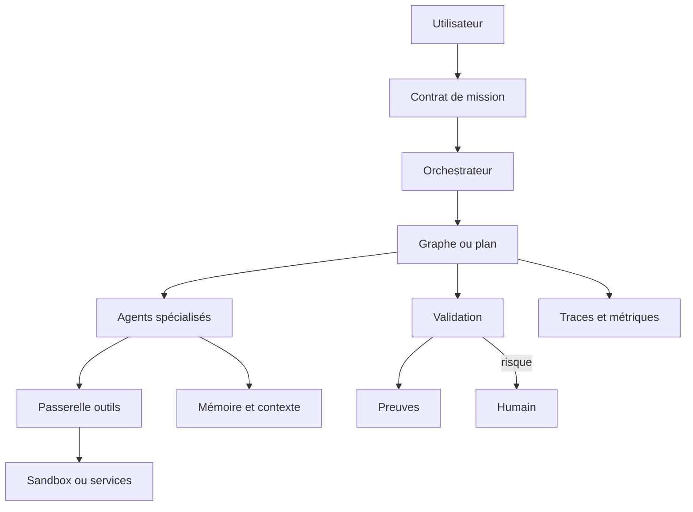
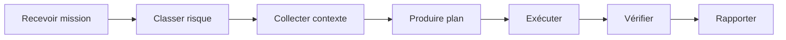

# Rapport 05 - Guide d'enseignement pour créer un vrai projet de pilotage agentique

## Objectif pédagogique

Ce document enseigne comment concevoir un projet agentique pilotable. Il part d'une idée simple : un agent seul peut aider, mais un système d'agents doit être gouverné comme un produit logiciel critique.

Un vrai projet de pilotage doit répondre à cinq questions :

1. Qui décide ?
2. Qui agit ?
3. Qui vérifie ?
4. Qui garde la mémoire ?
5. Qui prouve que le travail est terminé ?

## Définition d'un système de pilotage agentique

Un système de pilotage agentique est un ensemble de composants qui transforment une intention utilisateur en actions contrôlées, observables et vérifiables.

Il contient :

- une surface utilisateur ;
- un orchestrateur ;
- un plan ;
- des agents ;
- des outils ;
- une mémoire ;
- des validations ;
- des traces ;
- des preuves ;
- des politiques de sécurité.

## Architecture minimale



Cette architecture peut être petite au départ. Elle doit toutefois exister. Si le plan, les preuves et les permissions ne sont que dans le prompt, le système n'est pas réellement pilotable.

## Les composants obligatoires

### 1. Contrat de mission

Le contrat de mission décrit :

- demande utilisateur ;
- objectif ;
- hors périmètre ;
- niveau de risque ;
- livrables ;
- preuves attendues ;
- actions autorisées ;
- conditions d'arrêt ;
- escalade humaine.

Format minimal :

```yaml
mission:
  id: string
  user_goal: string
  scope:
    include: []
    exclude: []
  risk_level: read_only|write|execute|external
  deliverables: []
  evidence_required: []
  approvals_required: []
```

### 2. Orchestrateur visible

L'orchestrateur visible est l'unique interlocuteur de l'utilisateur. Il :

- clarifie l'intention ;
- choisit le modèle de pilotage ;
- crée ou met à jour le plan ;
- délègue ;
- intègre ;
- vérifie ;
- produit le rapport final.

Il ne doit pas cacher l'absence de preuve derrière une synthèse persuasive.

### 3. Registre d'agents

Chaque agent doit être déclaré :

```yaml
agent:
  id: code-reviewer
  role: Revue de changements code
  allowed_tools: [read_files, run_tests]
  denied_tools: [deploy, delete_files]
  input_contract: ReviewRequest
  output_contract: ReviewReport
  requires_human_approval: false
```

Le registre évite les agents improvisés sans limites.

### 4. Graphe ou plan d'exécution

Le graphe contient les étapes et transitions :

- classification ;
- planification ;
- collecte contexte ;
- exécution ;
- validation ;
- correction ;
- rapport.

Il doit être stocké hors prompt et modifiable par le runtime.

### 5. Passerelle d'outils

La passerelle applique les règles :

- quel agent peut appeler quel outil ;
- quels arguments sont autorisés ;
- quelle action exige validation ;
- quel résultat doit être contrôlé ;
- quel log doit être conservé.

### 6. Sandbox

La sandbox limite les effets :

- filesystem ;
- réseau ;
- processus ;
- secrets ;
- navigateur ;
- workspace ;
- session.

La sandbox est obligatoire pour les agents qui exécutent du code, naviguent, écrivent ou appellent des systèmes externes.

### 7. Mémoire et contexte

La mémoire doit être utile, pas seulement volumineuse.

Elle doit stocker :

- décisions ;
- sources ;
- preuves ;
- tâches ;
- erreurs ;
- préférences ;
- contraintes ;
- historiques de run.

Elle doit aussi permettre :

- correction ;
- invalidation ;
- filtrage par mission ;
- provenance ;
- séparation privé/partagé ;
- refus d'injection hostile.

### 8. Human-in-the-loop

Le HITL est requis pour :

- action destructive ;
- écriture hors espace de travail ;
- accès secret ;
- appel externe coûteux ;
- déploiement ;
- communication publique ;
- exploitation sécurité ;
- changement de politique.

Le HITL doit reprendre le run, pas le redémarrer.

### 9. Observabilité

Chaque run doit être inspectable :

- event log ;
- traces ;
- spans ;
- prompts ;
- contexte ;
- tools ;
- coûts ;
- erreurs ;
- décisions ;
- artefacts.

### 10. Evaluation

Chaque workflow important doit avoir des cas de test :

- succès nominal ;
- demande ambiguë ;
- contexte manquant ;
- refus attendu ;
- outil interdit ;
- échec tool ;
- reprise ;
- conflit mémoire ;
- preuve insuffisante.

### 11. Preuves de terminaison

Une mission n'est terminée que si la preuve est produite.

Exemples :

- fichier créé ;
- test exécuté ;
- diff ciblé ;
- rapport avec sources ;
- capture de trace ;
- ticket fermé ;
- validation humaine ;
- artefact déployé ;
- run reproduisible.

### 12. Politique de refus

Un bon système sait refuser :

- demande hors périmètre ;
- action interdite ;
- manque de contexte critique ;
- secret demandé ;
- environnement non autorisé ;
- preuve impossible ;
- conflit entre objectifs.

Le refus doit expliquer la condition manquante et proposer un chemin sûr.

## Les types de pilotage à enseigner

### Pilotage par checklist

Utile pour petits travaux. Exemple :

- lire les consignes ;
- inspecter le code ;
- modifier ;
- valider ;
- résumer.

Limite : faible reprise et faible observabilité.

### Pilotage par skill

Utile pour appliquer une méthode spécialisée. Exemple :

- design review ;
- documentation ;
- sécurité ;
- refactor ;
- test.

Limite : consigne non contraignante sans runtime.

### Pilotage par handoff

Utile pour spécialiser :

- analyste ;
- implémenteur ;
- reviewer ;
- testeur ;
- expert sécurité.

Limite : exige un contrat strict.

### Pilotage par graphe

Utile pour workflow sérieux :

- état clair ;
- branches ;
- reprise ;
- audit ;
- métriques.

Limite : nécessite une modélisation propre.

### Pilotage par Kanban

Utile quand l'opérateur doit coordonner plusieurs tâches ou agents.

Limite : doit être connecté à l'état réel, pas seulement aux intentions.

### Pilotage par runtime infra

Utile pour production et actions réelles :

- CRD ;
- worker ;
- sandbox ;
- RBAC ;
- queue ;
- logs.

Limite : complexité d'exploitation.

### Pilotage par observabilité

Utile pour améliorer :

- traces ;
- evals ;
- datasets ;
- feedback ;
- coûts.

Limite : nécessite de choisir les bonnes métriques.

## Choisir le bon modèle

| Situation | Choix recommandé |
| --- | --- |
| Une tâche simple de code | Agent solo outillé avec checklist et validation. |
| Plusieurs étapes répétables | Graphe d'état. |
| Expertise spécialisée | Handoff ou agent-as-tool. |
| Action risquée | HITL, sandbox et policy gate. |
| Grand codebase | Graphe de code, mémoire et contexte ciblé. |
| Travail multi-agent | Kanban ou plan avec ownership explicite. |
| Produit entreprise | Runtime infra, observabilité et RBAC. |
| Formation équipe | Skills, exemples, rapports de preuve. |

## Conception d'un premier projet

### Etape 1 - Définir le domaine

Exemples :

- assistant de code ;
- analyse de dépôt ;
- génération documentaire ;
- support client ;
- RAG métier ;
- pentest autorisé ;
- automatisation navigateur ;
- pilotage de CI.

Question clé : quelle action réelle le système peut-il faire ?

### Etape 2 - Définir les missions

Une mission doit être typée :

```yaml
mission_type:
  id: repo-analysis
  accepted_inputs:
    - path
    - question
  required_outputs:
    - report
    - source_matrix
  forbidden_actions:
    - write_source_code
    - deploy
```

### Etape 3 - Définir le plan minimal



### Etape 4 - Définir les agents

Commencer avec :

- orchestrateur ;
- chercheur contexte ;
- worker ;
- reviewer.

Ajouter ensuite :

- sécurité ;
- UX ;
- performance ;
- documentation ;
- intégration.

### Etape 5 - Définir les tools

Classer les tools :

| Classe | Exemples | Contrôle |
| --- | --- | --- |
| Lecture | fichiers, recherche, docs | Autorisé par périmètre |
| Ecriture | fichiers, tickets | Diff et preuve |
| Exécution | tests, scripts, commandes | Sandbox et logs |
| Externe | API, navigateur, cloud | Approval et audit |
| Destructif | delete, reset, deploy | Refus ou validation forte |

### Etape 6 - Définir les preuves

Avant d'implémenter le workflow, écrire :

- preuve de succès ;
- preuve de refus ;
- preuve d'échec récupérable ;
- preuve d'escalade ;
- preuve de non-régression.

### Etape 7 - Instrumenter

Minimum :

- run id ;
- task id ;
- agent id ;
- workflow version ;
- tool call ;
- status ;
- error ;
- artifact ;
- eval result.

## Exemple de runtime simple

```yaml
workflow:
  id: repo-analysis
  nodes:
    - id: intake
      type: deterministic
    - id: inventory
      type: tool
      tool: filesystem_scan
    - id: evidence
      type: agent
      agent: context-researcher
    - id: synthesis
      type: agent
      agent: orchestrator
    - id: review
      type: agent
      agent: reviewer
    - id: publish
      type: deterministic
  gates:
    - before: publish
      requires:
        - evidence_matrix
        - no_unresolved_high_risk
```

## Bonnes pratiques

### Faire

- Externaliser l'état.
- Versionner les workflows.
- Déclarer agents et tools.
- Mesurer par mission.
- Garder des preuves.
- Limiter les permissions.
- Tester refus et échecs.
- Garder l'orchestrateur utilisateur unique.
- Faire des handoffs bornés.
- Ajouter mémoire avec provenance.

### Eviter

- Swarm sans plan.
- Agent maître sans état.
- Outils globaux.
- Mémoire non nettoyable.
- UI sans preuve.
- Workflow visuel non versionné.
- Prompts énormes comme seule logique métier.
- Parallélisme sans ownership.
- Evaluation subjective seulement.

## Critères de maturité

| Niveau | Description | Critère de passage |
| --- | --- | --- |
| 0 | Prompt manuel | L'agent aide mais ne pilote pas. |
| 1 | Checklist | Les étapes sont connues. |
| 2 | Plan stocké | L'état sort du prompt. |
| 3 | Tools contrôlés | Les actions sont bornées. |
| 4 | Handoffs | Les spécialistes ont contrats et preuves. |
| 5 | Graphe durable | Reprise et audit existent. |
| 6 | Observabilité | Les runs sont mesurés. |
| 7 | Evaluation | Les workflows régressent moins. |
| 8 | Sandbox infra | Les actions réelles sont isolées. |
| 9 | Optimisation | Le système apprend sous contrôle. |

## Application à Grimoire

Pour un projet Grimoire de pilotage, la proposition pédagogique devient :

- `grimoire-master` est l'orchestrateur visible.
- Le Mission Board porte les missions, états et preuves.
- Les agents internes sont des capacités déclarées.
- Les tools host passent par un pont de capacités.
- La mémoire partagée contient seulement des faits avec source.
- Les artefacts produits sont gouvernés.
- Les actions risquées exigent preuve ou validation.
- Les rapports finaux citent chemins, lignes et limites.

## Exercice d'enseignement

Demander aux apprenants de concevoir un workflow `analyse-repo` :

1. Définir le contrat de mission.
2. Définir quatre agents maximum.
3. Définir les tools par agent.
4. Dessiner le graphe.
5. Définir les preuves.
6. Définir trois cas d'échec.
7. Définir les traces.
8. Définir la politique de mémoire.
9. Définir le rapport final.

Critère de réussite : le workflow doit pouvoir être interrompu, inspecté, repris et audité sans relire toute la conversation.

## Conclusion

Créer un vrai projet de pilotage agentique consiste à réduire l'ambiguïté opérationnelle. Les modèles génératifs peuvent planifier, rédiger, explorer et proposer. Le système de pilotage doit décider ce qui est autorisé, stocker ce qui s'est passé, vérifier ce qui est livré et protéger l'environnement.

La meilleure architecture n'est pas celle qui promet le plus d'autonomie. C'est celle qui transforme l'autonomie en actions contrôlées, mesurées et prouvées.

