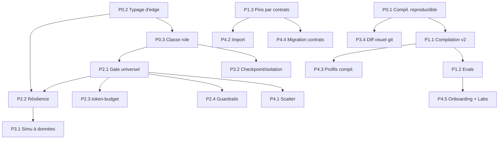

# Raffinement — Blueprint Studio à la lumière des best-practices agentiques

Date : 2026-07-08. Portée : raffiner la proposition Studio v2 déjà brainstormée
(`BRAINSTORM-blueprint-features.md`, `BRAINSTORM-XXL-blueprint-studio.md`) et
l'inventaire des 93 dormants, en y appliquant une grille d'ingénierie
agentique état de l'art. Ce document **ne répète pas** les deux brainstorms :
il en corrige le design, comble les angles morts et réordonne le plan.

Invariant conservé, cité tel quel : le blueprint **se valide, se simule, se
compile — n'exécute jamais**. Ce document en tire une conséquence que les deux
brainstorms n'exploitent pas : si le Studio n'exécute pas, alors *rien dans le
Studio ne prouve qu'un artefact compilé se comporte correctement*. Combler ce
point aveugle est le fil rouge du raffinement.

---

## 1. Le point aveugle de l'invariant

« Compile, n'exécute jamais » est la bonne décision : déclaratif, revu en PR,
exécuté par l'hôte. Mais il crée un trou : la validation actuelle (live client,
lint serveur, simulation topologique) vérifie la **forme** — contrats
compatibles, portes présentes, ordre topologique — jamais le **comportement**.
Un blueprint peut être vert sur les trois niveaux et produire des agents qui
hallucinent, bouclent, ou coûtent dix fois la prévision.

Les deux brainstorms empilent des capacités d'anticipation (coût, what-if,
verdict sécurité) mais aucune ne ferme ce trou. La grille agentique 2026 le
ferme avec trois pièces que la proposition sous-traite ou omet :

1. **Evals comportementaux** attachés au graphe (section 4.B) — la seule preuve
   directe de comportement sans exécuter dans le Studio.
2. **Famille résilience** (section 4.A) — un flow se définit par sa façon
   d'échouer, pas seulement de réussir. Absente de la proposition.
3. **Compilation reproductible** (section 4.H) — sans build déterministe, « le
   diff git est la revue » est un slogan, pas une garantie.

Ces trois-là remontent en priorité (section 5). Tout le reste est du confort.

---

## 2. Refonte du design : une algèbre minimale de nodes

La proposition XXL liste ~20 types de cases répartis en 5 familles. C'est un
risque de *node soup* : 20 entrées de palette à apprendre, 20 compilateurs à
écrire, 20 chemins de curation Labs. La best-practice de composabilité impose
l'inverse : trouver le petit ensemble orthogonal de primitives, et exprimer
tout le reste comme paramétrage ou sucre syntaxique.

Le format actuel garde son champ `kind` (`pattern | artifact | composite |
extension-node` — *ce que la case référence*). On ajoute par-dessus une
**classe sémantique orthogonale** (`role`), pilotée par la config, pas par de
nouveaux kinds :

| Classe | Rôle unique | Compile vers |
|---|---|---|
| **Unit** | La seule primitive « qui fait » : consomme des contrats, produit des contrats (agent, artefact, pattern, node d'extension) | Artefact gouverné (agent.md, étape de workflow) |
| **Route** | Branchement déclaratif sur verdict / seuil / étiquette | Règle de policy (GOV-01), sections conditionnelles |
| **Scatter** | Éclatement parallèle (map sur N items, borné) — *nouveau, complète la paire* | Contrainte de parallélisme + garde de budget |
| **Gather** | Jointure : fan-in, quorum, consensus | Contrat d'agrégation (handoff-packets multiples) |
| **Gate** | Précondition universelle qui doit tenir pour passer | GOV-xx / QUA-xx selon paramètre |
| **Boundary** | Annotation transversale posée sur une région ou un edge (ne « fait » rien) | Métadonnée de workflow |
| **Reference** | Pointeur vers quelque chose hors-graphe | Section prérequis / config |

Les 20 cases de la proposition XXL deviennent des **paramètres** de ces 7
classes, ce qui divise par trois la surface à construire et à curer :

| Case proposée (XXL) | Devient |
|---|---|
| Décision / branche | `Route` |
| Boucle bornée | `Boundary(loop, budget-max)` + `Gate(budget)` |
| Porte humaine | `Gate(human)` |
| Jonction / fan-in | `Gather(quorum)` |
| Consensus critique | `Gather(quorum + avocat du diable)` |
| Déclencheur | `Reference(trigger)` — en-tête, pas un node de graphe |
| MCP toolbox | `Reference(mcp)` + `Gate(mcp-trust)` obligatoire en amont |
| Notification sortante | `Unit(effet de bord, permission réseau)` |
| Ressource / secret | `Reference(resource)` |
| Source documentaire | `Reference(doc-source)` |
| Mémoire lecture / écriture | `Reference(memory, r\|w)` |
| Signal stigmergique | `Reference(signal, emit\|listen)` |
| Garde de budget | `Gate(budget)` |
| Checkpoint de preuve | `Gate(evidence)` |
| Sonde d'observation | `Boundary(telemetry-probe)` |
| Contrat de sortie | `Gate(output-contract)` |
| Sous-blueprint / registry / variable | `Reference(...)` |

Bénéfice décisif pour le canal Labs : on ne teste plus en beta « un nouveau
type de node » mais « une nouvelle **configuration** d'une primitive connue ».
La curation devient un tableau de paramètres éprouvés, pas un bestiaire.

### 2.1 Le levier caché : typer les edges

La proposition ne type pas les edges au-delà du contrat échangé. Un seul ajout
au format débloque toute la famille résilience sans aucun node neuf :

> Chaque edge porte un `channel` : `happy` (défaut) | `failure` | `escalation`.

Conséquences en cascade :

- La **résilience** (section 4.A) s'exprime en edges `failure`, pas en nouvelles
  cases : retry, fallback, compensation, dead-letter sont des chemins typés.
- Le **diff git** montre explicitement les chemins d'échec — un reviewer voit
  « ce flow n'a aucun edge failure vers la case déploiement » d'un coup d'œil.
- La **simulation** peut injecter un échec sur un node et suivre le chemin
  `failure` — le what-if devient un test de résilience.

---

## 3. Cartographie best-practice → proposition actuelle

Grille : les disciplines qui définissent l'ingénierie agentique 2026, croisées
avec leur couverture dans les deux brainstorms.

| Discipline agentique | État dans la proposition | Verdict |
|---|---|---|
| Composition typée (contrats aux frontières) | Pins/edges + curation catalogue | Couvert, à finir |
| Gouvernance / preuve (gates, evidence) | Famille GOV/QUA riche | Couvert |
| Human-in-the-loop | Une seule « porte humaine » | **Trop pauvre** (4.F) |
| Résilience / échec / compensation | Absent | **Manque majeur** (4.A) |
| Evals comportementaux | Absent (assertions de structure ≠ comportement) | **Manque majeur** (4.B) |
| Ingénierie de contexte (budget, compaction, isolation) | Coût tokens seulement | **Manque** (4.C) |
| Parallélisme / map-reduce | Fan-in seul, pas de fan-out | **Manque** (4.D) |
| Guardrails I/O (injection, PII, contenu) | Contrat de schéma seulement | **Manque** (4.E) |
| État durable / checkpoint / reprise | Absent | **Manque** (4.F) |
| Observabilité portable (OTel GenAI) | events.jsonl propriétaire | **À aligner** (4.G) |
| Reproductibilité du build | Hash tracé, déterminisme non garanti | **À durcir** (4.H) |
| Migration de contrats (versioning) | catalogVersion tracé, pas de codemod | **Manque** (4.I) |
| Pipeline promotion/déprécation mesuré | Canal Labs sans seuils chiffrés | **À chiffrer** (4.J) |

---

## 4. Les dix raffinements

### 4.A — Famille résilience (le manque structurel n°1)

Un système agentique se juge à ses échecs. La proposition n'a aucune primitive
pour : réessayer avec borne, basculer sur un modèle de secours, compenser un
effet de bord (saga), ou escalader vers l'humain quand tout échoue. Grâce au
typage d'edge (2.1), aucun node neuf n'est requis :

- **Retry borné** : `Boundary(retry, max=n, backoff)` sur une région, edge
  `failure` qui reboucle jusqu'à la borne. Refus de compiler sans borne (même
  règle que la boucle bornée).
- **Fallback** : edge `failure` d'un `Unit` vers un `Unit` de secours (modèle
  moins cher/plus robuste). Le verdict de coût affiche le pire cas.
- **Compensation** : edge `failure` vers un `Unit` qui annule un effet de bord
  déjà émis (rollback d'une notification, d'une écriture).
- **Dead-letter / escalation** : edge `escalation` terminal vers `Gate(human)`
  ou `Reference(signal ALERT)` — jonction directe avec la stigmergie livrée.

Dormants réveillés : `self-healing` (auto-réparation de workflows),
`early-warning`, `failure-museum` (chaque échec compilé alimente le catalogue
structuré des échecs — le « rien ne se perd » prend corps).

Compile vers : sections `on_failure` du mission pack ; le runtime hôte
(orchestrateur, CI) reste l'exécutant.

### 4.B — Evals comportementaux first-class (le manque structurel n°2)

La proposition a des « tests de blueprint » (assertions sur la structure :
« tout chemin vers déploiement passe par une porte QUA »). C'est nécessaire,
insuffisant : ça ne dit rien du comportement des agents compilés. La grille
2026 exige une **suite d'évals** attachée au flow ou au node.

- Attacher à un `Unit` (ou au blueprint entier) une suite d'évals versionnée
  avec le `.blueprint.json` : cas d'entrée + assertion sur la sortie (contrat
  respecté, coût sous seuil, pas de refus, verdict attendu).
- Dormants exacts pour ça : `agent-test` (tests comportementaux d'agents),
  `agent-bench`, `gen-tests` (scaffolding depuis acceptance criteria).
- Le panneau santé affiche un **taux de réussite d'éval** par node, pas
  seulement un score de lint statique.
- Compile vers des checks CI : `grimoire standard gate check` sait déjà router
  côté standard ; l'éval devient un gate de compilation optionnel-puis-requis.

C'est la pièce qui referme le point aveugle de l'invariant (section 1) : on ne
sait toujours pas exécuter *dans* le Studio, mais on sait attacher la preuve
comportementale qui sera exécutée par l'hôte, et l'afficher sur le graphe.

### 4.C — Surface d'ingénierie de contexte

La proposition ne connaît qu'une dimension de coût : les tokens (table
statique `NODE_COST`, à calibrer). Or la discipline centrale de 2026 est
l'*ingénierie de contexte* — ce qui entre dans la fenêtre, la compaction, et
surtout l'**isolation**. Trois ajouts, distincts du coût :

- **Budget de contexte par node** : combien de contexte ce `Unit` reçoit, et
  quelle stratégie de compaction (résumé, troncature, RAG). Distinct du coût
  total ; c'est une décision de *design*, pas de facturation.
- **Frontière d'isolation** : `Boundary(isolation)` marque les nodes qui
  tournent en contexte isolé (sous-agent quarantiné, patron orchestrateur-
  worker) vs contexte partagé. Décision architecturale majeure, aujourd'hui
  invisible dans le graphe. Le viewer devrait la dessiner (halo/zone).
- **Pression de contexte** : la simulation estime, par node, si le contexte
  cumulé approche la limite du modèle — signal avant que ça casse en prod.

Dormants : `context-summarizer`, `context-merge`, `sensory-buffer`,
`semantic-cache` (cache de réponses pour couper le coût des sous-appels
identiques).

### 4.D — Parallélisme / fan-out (compléter la paire)

La proposition a le fan-in (`Gather`) mais pas son symétrique : lancer N
branches en parallèle et rassembler (map-reduce agentique — un pattern
canonique : « analyser 12 fichiers en parallèle, agréger »). Le `Scatter` de
la section 2 comble ça, borné par un `Gate(budget)` obligatoire (le
parallélisme non borné est le premier facteur d'explosion de coût).

Dormant exact : `hpe-runner` / `hpe-executors` / `hpe-monitor` (parallélisme
hybride). Compile vers : contrainte de parallélisme dans le workflow + plafond.

### 4.E — Couche guardrails (distincte du contrat de schéma)

`Gate(output-contract)` valide un JSON Schema. Il ne protège de rien côté
sécurité. La grille 2026 exige des guardrails I/O comme famille de `Gate` :

- **Guardrail entrée** : anti-injection de prompt, filtrage PII — critique
  précisément sur les frontières `Reference(mcp)` et `extension-node`, où du
  contenu externe non fiable entre dans le flow.
- **Guardrail sortie** : politique de contenu, fuite de secret, PII sortante —
  avant toute `Unit(notification sortante)`.
- Le **verdict de sécurité** (déjà proposé, permissions agrégées) devient la
  vue de synthèse de ces gates : surface d'attaque + points de filtrage
  déclarés. Refus de compiler un flow où un node externe alimente une sortie
  sans guardrail intermédiaire.

Dormant : `bias-toolkit` (catalogue de biais) pour la variante « guardrail de
raisonnement » sur les nodes de décision.

### 4.F — Human-in-the-loop riche + état durable

« Porte humaine » est un seul point sur un spectre. La best-practice distingue
au moins : **approuver**, **corriger/éditer** la sortie, **fournir un input
manquant**, **échantillonner** (revue de X % des runs), **escalade sur
incertitude** (verdict de confiance sous seuil). Ce sont des paramètres de
`Gate(human, mode=...)`, pas de nouveaux nodes.

Corollaire non traité : une porte humaine **suspend** le flow. Suspendre exige
un **checkpoint d'état durable** — sinon « reprendre après approbation » est
impossible. D'où `Boundary(checkpoint)` : marque les frontières où l'état est
persisté et le flow reprenable. C'est aussi le socle du replay comparatif.

Dormants : `time-travel` (checkpoints, replay, bisect) est exactement le
moteur de reprise ; `decision-log` (chaîne hash-chaînée) journalise chaque
décision humaine de façon auditable.

### 4.G — Aligner l'observabilité sur OTel GenAI

La télémétrie se lie à `events.jsonl` (propriétaire). La `Boundary(telemetry-
probe)` devrait compiler *aussi* vers des spans conformes aux **conventions
sémantiques OpenTelemetry GenAI** (span par appel LLM / tool, usage de tokens,
modèle). Effet : le blueprint devient observable dans n'importe quel backend
(Grafana, Langfuse, Phoenix…) sans coupler le projet à `events.jsonl`. Le
replay SSE reste la vue native ; OTel est la porte de sortie standard.

Dormants : `synapse-trace` (déjà intégré, site), `synapse-dashboard`.

### 4.H — Compilation reproductible (durcir l'invariant)

« Le diff git est la revue » n'a de valeur que si la compilation est
**déterministe** : même blueprint + même `catalogVersion` → artefacts
byte-identiques. Sinon chaque recompilation produit du bruit de diff et la
revue devient impossible. À inscrire dans les invariants non négociables, à
côté de « compile n'exécute jamais », et à **tester en CI** (compiler deux
fois, comparer les hashes). Ordre de clés stable, pas d'horodatage volatil
dans le corps de l'artefact (l'horodatage vit dans `compiled.at`, hors hash).

### 4.I — Migration de contrats (le maillon de cycle de vie manquant)

Quand le catalogue fait évoluer un contrat, les blueprints existants cassent
silencieusement. La proposition trace `catalogVersion` mais n'offre aucun
chemin de migration. Dormant exact : `cross-migrate`. Livrable : un codemod
qui, à la montée de `catalogRef.version`, propose les remaps de contrats
(`rosetta` pour le mapping terminologique) et signale les ruptures dans
l'éditeur — un « blueprint doctor » de mise à niveau.

### 4.J — Chiffrer le pipeline Labs (promotion & déprécation)

Le canal beta/Labs est excellent mais « se promeut sur métriques » reste un
vœu tant que les seuils ne sont pas chiffrés. Proposition concrète, dérivée du
journal du Studio (compteur de poses par type, déjà envisagé) :

- **Promotion** d'une config Labs → palette standard : utilisée dans ≥ 5
  blueprints réels distincts **ou** ≥ N compilations sur ≥ 30 jours glissants,
  **et** zéro régression de gate non résolue, **et** au moins une éval qui en
  dépend passe.
- **Déprécation** : 0 usage sur 60 jours glissants **et** aucune éval
  dépendante → archivage (pas suppression). Les doublons (`doc-fetcher` /
  `docs-fetcher`) sont archivés d'office.
- Chaque réveil = **une PR** (tests + doc + entrée Labs), jamais une vague.

---

## 5. Re-priorisation critique

La priorisation XXL enterre en vague 3 des éléments qui sont en réalité des
**prérequis de confiance**. Réordonnancement selon le fil rouge (section 1) :
d'abord prouver le comportement et l'échec, ensuite anticiper, enfin rayonner.

### Phase 0 — Invariants & socle de confiance

Prérequis de tout le reste, faible surface, fort effet de levier.

1. **Compilation reproductible** + test CI de double-compilation (4.H).
2. **Typage d'edge** (`channel: happy|failure|escalation`) au format (2.1).
3. **Classe sémantique de node** (`role`) + re-catégorisation de la palette
   Labs par les 7 primitives (section 2).

### Phase 1 — Fermer le point aveugle (le socle « gouverné »)

4. **Compilation v2 team → vrais artefacts** (vague 1 de la proposition, item 1
   des deux brainstorms — le chaînon manquant).
5. **Evals comportementaux first-class** (4.B) — `agent-test`/`agent-bench`
   réveillés, panneau taux de réussite. *Remonté de la vague 3 implicite.*
6. **Curation des pins par contrats catalogue** (vague 1, supprime
   l'heuristique `FAMILY_PINS`).

### Phase 2 — Résilience & gouvernance de flux (unifiées)

7. **Gate universel paramétré** (human riche, budget, evidence, output-
   contract, guardrail, mcp-trust) — une primitive, N paramètres (2, 4.E, 4.F).
8. **Famille résilience** via failure-edges (4.A) — `self-healing`,
   `failure-museum` réveillés.
9. **token-budget réveillé** : `Gate(budget)` + coût calibré remplaçant
   `NODE_COST` (vague 2 de la proposition).
10. **Verdict de sécurité** agrégé + guardrails I/O (4.E).

### Phase 3 — Anticipation & observation

11. **Simulation à données** + what-if (`digital-twin`) + injection d'échec sur
    failure-edges (4.A + vague 2).
12. **Frontières checkpoint / isolation** (4.C, 4.F) — visuel + compile ;
    `time-travel` pour la reprise.
13. **Replay SSE** + alignement **OTel GenAI** (4.G).
14. **Diff visuel git** du graphe (vague 1, item 4 XXL — la jonction revue).

### Phase 4 — Écosystème & rayonnement

15. **Scatter / map-reduce** (4.D) — `hpe-runner`.
16. **Import CrewAI / LangGraph** + `rosetta` + **profils de compilation
    multi-cibles** (Copilot, Claude Code, markdown pur).
17. **Migration de contrats** (4.I) — `cross-migrate`.
18. **Onboarding crescendo** + tutoriels use-cases + export mermaid/PNG.
19. **Chiffrage du pipeline Labs** (4.J) opérationnalisé sur le journal.

---

## 6. Plan de travail — chantiers, dépendances, preuve

Sans estimations temporelles (charte). Chaque chantier déclare son livrable et
sa **preuve** (ce qui prouve qu'il est fait), conformément à la gouvernance
d'artefacts du projet.

| # | Chantier | Dépend de | Livrable | Preuve |
|---|---|---|---|---|
| P0.1 | Compilation reproductible | — | Compilateur à clés stables, horodatage hors hash | Test CI : 2 compilations → hashes identiques |
| P0.2 | Typage d'edge | — | `channel` au schéma + migration | Schéma versionné, blueprints existants migrés sans perte |
| P0.3 | Classe `role` + palette Labs | P0.2 | 7 primitives documentées, palette re-catégorisée | Chaque case XXL mappée à une primitive (table §2) |
| P1.1 | Compilation v2 team → artefacts | P0.1 | `.agent.md`/hooks shadow/skills par node | Diff git lisible, gates passés (skill-analyzer) |
| P1.2 | Evals first-class | P1.1 | Suite d'évals attachable + panneau taux | `agent-test` vert sur un blueprint réel |
| P1.3 | Pins par contrats catalogue | — | `contracts:{consumes,produces}` par pattern, exporté | Fin de la duplication `FAMILY_PINS`/`STUDIO_FAMILY_PINS` |
| P2.1 | Gate universel paramétré | P0.3 | Un compilateur `Gate` + N paramètres | Human/budget/evidence/output/guardrail/mcp-trust couverts |
| P2.2 | Famille résilience | P0.2, P2.1 | failure-edges → sections `on_failure` | Un flow refuse de compiler sans borne sur retry |
| P2.3 | token-budget + coût calibré | P2.1 | Endpoint `/api/cost-model`, node budget | Vue COÛT étiquetée « calibré » (plus « hypothèses ») |
| P2.4 | Verdict sécurité + guardrails | P2.1 | Surface d'attaque agrégée + gates I/O | Refus si node externe → sortie sans guardrail |
| P3.1 | Simulation à données + what-if | P2.2 | Injection task-envelope + digital-twin | Un échec injecté suit le failure-edge attendu |
| P3.2 | Checkpoint / isolation | P0.3 | `Boundary` checkpoint/isolation, visuel | Reprise après `Gate(human)` documentée (time-travel) |
| P3.3 | Replay SSE + OTel | — | Onglet replay sur `/api/events` + export spans | Une session réelle rejouée + spans OTel valides |
| P3.4 | Diff visuel git | P0.1 | Vue nodes/edges ajoutés/retirés HEAD↔courant | Un reviewer voit le graphe changer, pas du JSON |
| P4.1 | Scatter / map-reduce | P2.1 | `Scatter` borné + hpe-runner | Un flow map-reduce compile avec plafond |
| P4.2 | Import CrewAI/LangGraph | P1.3 | Adaptateurs inverses + rosetta | Un crew YAML → graphe équivalent |
| P4.3 | Profils de compilation | P1.1 | Sélecteur de cible, un graphe → N cibles | Même blueprint → `.github/*` et `.claude/*` |
| P4.4 | Migration de contrats | P1.3 | Codemod à la montée de catalogVersion | Rupture de contrat signalée + remap proposé |
| P4.5 | Onboarding + pipeline Labs chiffré | P1.2 | Crescendo + seuils promotion/déprécation | Journal Studio pilote une promotion réelle |

### Vue des dépendances

---

## 7. Ce qu'il faut refuser ou différer

Dire non fait partie du raffinement.

- **Node soup** : ne jamais livrer une case dont la sémantique se réduit à un
  paramètre d'une primitive existante. La palette Labs liste des
  *configurations*, pas des types.
- **Exécution déguisée** : toute feature qui ferait tourner un agent *dans* le
  Studio viole l'invariant. Les évals et le replay observent une exécution
  hôte ; ils n'en créent pas.
- **Overlay de conformité réglementaire** (AI Act, résidence des données) :
  séduisant pour un « OS agentique gouverné », mais lourd et hors du besoin
  démontré. Différé jusqu'à demande réelle.
- **Collaboration temps réel multi-curseur** : les annotations de revue
  suffisent ; le co-édition live est un chantier disproportionné.
- **Réveil en vague** des 93 dormants : un réveil = une PR gated. Les gadgets
  bio-inspirés sans thèse produit claire attendent la déprécation, pas la
  palette.

---

## 8. Thèse en une phrase

Le Studio actuel sait *composer et compiler* un flow ; le raffinement le rend
capable de *prouver comment il se comporte et comment il échoue* — evals,
failure-edges et build reproductible — le tout construit sur une algèbre de
sept primitives plutôt qu'un bestiaire de vingt cases, et rayonné via un canal
Labs dont les seuils de promotion sont enfin chiffrés.
