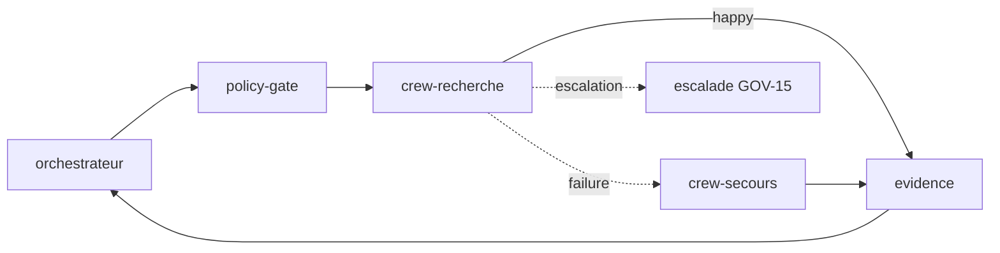

# Spec — Failure-edges & évals attachables

Date : 2026-07-08. Portée : spécifier les deux pièces structurelles du
raffinement (`RAFFINEMENT-blueprint-studio-agentic.md`, sections 4.A et 4.B) au
niveau du format `.blueprint.json` v1, de façon **additive et rétro-compatible**
avec `schemas/blueprint.schema.json`. Rien ici ne change `blueprintVersion`
(reste `1`) : tous les ajouts sont optionnels, un blueprint existant reste
valide.

Deux mécaniques, un même but : rendre visible et compilable ce que le format
ignore aujourd'hui — *comment un flow échoue* et *comment on prouve qu'il se
comporte*.

---

## 0. Rappel des contraintes du schéma réel

Le schéma impose `additionalProperties: false` sur la racine, les nodes, les
edges et les pins. Toute nouvelle clé doit donc être **déclarée** dans le
schéma — on présente ci-dessous des deltas, pas des ajouts libres. Seul
`node.config` est ouvert (`type: object`, sans restriction) : c'est le point
d'extension légitime pour la config par-node, mais on lui donne quand même un
sous-schéma nommé pour que le lint le vérifie.

Rappels de patterns : `id` de node en kebab (`^[a-z0-9]+(-[a-z0-9]+)*$`),
`contract` en kebab, `pinRef` = `nodeId.pinId`.

---

## 1. Failure-edges (résilience sans node neuf)

### 1.1 Principe

Aujourd'hui un edge = `{from, to, contract}` et représente le seul chemin
nominal. On ajoute un **canal** à l'edge. Le graphe porte alors deux plans
superposés : le plan nominal (`happy`) et le plan de défaillance
(`failure` / `escalation`), visuellement distincts et diffables séparément.

> Un edge `failure` transporte un **contrat d'erreur** (`error-envelope`), pas
> le contrat nominal. C'est ce qui distingue un chemin d'échec d'un simple
> branchement `Route`.

### 1.2 Delta de schéma — edge

```json
"edges": {
  "type": "array",
  "items": {
    "type": "object",
    "additionalProperties": false,
    "required": ["from", "to", "contract"],
    "properties": {
      "from": { "$ref": "#/$defs/pinRef" },
      "to": { "$ref": "#/$defs/pinRef" },
      "contract": { "type": "string", "pattern": "^[a-z0-9]+(-[a-z0-9]+)*$" },
      "channel": {
        "type": "string",
        "enum": ["happy", "failure", "escalation"],
        "default": "happy",
        "description": "Plan de l'edge. Absent = happy (rétro-compatible)."
      }
    }
  }
}
```

Un edge sans `channel` reste un edge nominal : tous les blueprints existants
sont valides sans modification.

### 1.3 Contrat d'erreur

Nouveau contrat de catalogue `error-envelope`, symétrique du `task-envelope` :

| Champ | Rôle |
|---|---|
| `nodeId` | Node qui a échoué |
| `class` | `timeout` \| `contract-violation` \| `guardrail-block` \| `budget-exceeded` \| `tool-error` \| `refusal` \| `unknown` |
| `attempt` | Numéro de tentative (pour le retry borné) |
| `detail` | Message court, non sensible |

Un node « qui fait » (classe `Unit`) expose implicitement un pin de sortie
d'erreur `error` de contrat `error-envelope` ; il n'a pas besoin d'être déclaré
dans `pins` (le compilateur le synthétise), mais peut l'être pour être câblé
explicitement dans l'éditeur.

### 1.4 Politique de résilience par-node (`config.resilience`)

Le retry simple et le timeout n'ont pas besoin d'un edge : ils vivent dans
`config`, ouvert par le schéma. On leur donne un sous-schéma nommé pour le lint :

```json
"$defs": {
  "resiliencePolicy": {
    "type": "object",
    "additionalProperties": false,
    "properties": {
      "retry": {
        "type": "object",
        "additionalProperties": false,
        "required": ["max"],
        "properties": {
          "max": { "type": "integer", "minimum": 1, "maximum": 10 },
          "backoffMs": { "type": "integer", "minimum": 0 },
          "strategy": { "enum": ["fixed", "linear", "exponential"] }
        }
      },
      "timeoutMs": { "type": "integer", "minimum": 1 },
      "onExhaustion": {
        "enum": ["escalate", "deadletter", "compensate"],
        "description": "Que faire quand retry épuisé — route vers un edge failure/escalation"
      }
    }
  }
}
```

Invariant repris de la boucle bornée : `retry` **sans** `max` ne compile pas.
`max` est plafonné (10) pour interdire les boucles quasi-libres.

### 1.5 Les quatre motifs de résilience, en format

| Motif | Expression | Visible dans le diff |
|---|---|---|
| **Retry borné** | `config.resilience.retry` sur le `Unit` | Non (node-local) — bon pour le bruit |
| **Fallback** | edge `channel:"failure"` du pin `error` vers un `Unit` de secours | Oui — chemin explicite |
| **Compensation** | edge `channel:"failure"` vers un `Unit` d'annulation d'effet + `onExhaustion:"compensate"` | Oui |
| **Dead-letter / escalade** | edge `channel:"escalation"` terminal vers `Gate(human)` ou `Reference(signal ALERT)` | Oui |

Règle de curation : le retry (fréquent, peu signifiant) reste node-local pour
ne pas polluer le graphe ; fallback / compensation / escalade (décisions
d'architecture) sont des edges, parce qu'un reviewer *doit* les voir.

### 1.6 Compilation

Le mission pack gagne une section `on_failure` par node résilient et un plan de
défaillance global :

| Élément blueprint | Section compilée |
|---|---|
| `config.resilience.retry` | Directive « réessayer au plus `max` fois, backoff `strategy` » dans la fiche du node |
| `config.resilience.timeoutMs` | Garde de temps dans la fiche du node |
| edge `failure` → `Unit` secours | Étape « en cas d'échec de X, invoquer Y avec l'`error-envelope` » |
| edge `escalation` → `Gate(human)` | Checkpoint GOV-15 : escalade humaine documentée |
| `onExhaustion` | Terminaison du plan de défaillance (deadletter/compensate/escalate) |

L'exécutant reste l'hôte (orchestrateur / CI). Le blueprint **déclare** la
politique ; il ne réessaie rien lui-même.

### 1.7 Simulation

- La simulation nominale ignore les edges `failure`/`escalation` (plan happy
  seul) — l'ordre topologique reste lisible.
- Nouveau mode **injection d'échec** : choisir un node, une `class` d'erreur →
  la simulation suit le plan de défaillance et affiche le chemin réel
  (retry → fallback → escalade). C'est le what-if de résilience (jonction avec
  `digital-twin`).
- Un node effectful (permission réseau/écriture) **sans** aucun chemin de
  défaillance et **sans** `resilience` déclenche un avertissement de simulation.

---

## 2. Évals attachables (preuve de comportement)

### 2.1 Principe

Les « tests de blueprint » proposés vérifient la structure. Les évals
vérifient le **comportement** de l'artefact compilé — la seule preuve directe
sans exécuter dans le Studio. Une suite d'évals est versionnée *avec* le
`.blueprint.json`, ciblant un node ou le flow entier.

Les évals ne s'exécutent pas dans le Studio : elles **compilent** en checks
que l'hôte lance (`grimoire standard gate check`, CI). Le Studio les édite, les
affiche, et surligne le dernier taux de réussite connu.

### 2.2 Delta de schéma — section racine `evals`

```json
"evals": {
  "type": "object",
  "additionalProperties": false,
  "properties": {
    "suites": {
      "type": "array",
      "items": {
        "type": "object",
        "additionalProperties": false,
        "required": ["id", "target", "cases"],
        "properties": {
          "id": { "type": "string", "pattern": "^[a-z0-9]+(-[a-z0-9]+)*$" },
          "target": {
            "type": "string",
            "description": "nodeId ou le littéral 'blueprint'"
          },
          "cases": {
            "type": "array",
            "minItems": 1,
            "items": { "$ref": "#/$defs/evalCase" }
          }
        }
      }
    }
  }
}
```

Ajout à la liste `properties` de la racine (qui reste `additionalProperties:
false`). Optionnel : absence = aucune éval, blueprint valide.

### 2.3 Cas et assertions

```json
"$defs": {
  "evalCase": {
    "type": "object",
    "additionalProperties": false,
    "required": ["id", "given", "expect"],
    "properties": {
      "id": { "type": "string", "pattern": "^[a-z0-9]+(-[a-z0-9]+)*$" },
      "given": {
        "type": "object",
        "description": "Task-envelope d'entrée (généré ou saisi), ou fixture référencée",
        "properties": {
          "input": { "type": "object" },
          "fixture": { "type": "string" },
          "injectFailure": {
            "type": "object",
            "additionalProperties": false,
            "properties": {
              "nodeId": { "type": "string" },
              "class": { "type": "string" }
            }
          }
        }
      },
      "expect": {
        "type": "array",
        "minItems": 1,
        "items": { "$ref": "#/$defs/assertion" }
      }
    }
  },
  "assertion": {
    "type": "object",
    "additionalProperties": false,
    "required": ["type"],
    "properties": {
      "type": {
        "enum": [
          "contract-holds", "cost-under", "latency-under",
          "no-refusal", "verdict-equals", "contains", "matches",
          "guardrail-pass", "path-taken"
        ]
      },
      "value": {
        "description": "Argument de l'assertion (seuil, étiquette, motif, liste de nodes...)"
      }
    }
  }
}
```

Vocabulaire d'assertions, minimal et typé :

| Assertion | `value` | Prouve |
|---|---|---|
| `contract-holds` | (aucun) ou pin id | La sortie valide le contrat du pin |
| `cost-under` | tokens/USD | Coût réel sous seuil (branché sur `token-budget`) |
| `latency-under` | ms | Latence sous seuil |
| `no-refusal` | (aucun) | L'agent ne refuse pas la tâche |
| `verdict-equals` | étiquette | Verdict QUA attendu |
| `contains` / `matches` | texte / regex | Présence dans la sortie |
| `guardrail-pass` | (aucun) | Aucun flag PII / injection |
| `path-taken` | liste `nodeId`/edge+channel | Le run a suivi le chemin attendu — **relie évals et failure-edges** : `injectFailure` + `path-taken` prouve que l'escalade se déclenche |

### 2.4 Compilation & résultats

- Chaque `suite` compile vers un artefact de check tracé dans
  `compiled.artifacts` (`path`, `hash`, `sourceNode = target`) — donc soumis à
  la détection de dérive comme les autres artefacts.
- Les **résultats** de run ne vivent pas dans le `.blueprint.json` (ce sont des
  sorties d'exécution). Ils atterrissent en sidecar
  `.github/prompts/{id}.evals.jsonl` (une ligne par run : suite, case, verdict,
  coût), lu par le panneau santé pour afficher le taux de réussite.
- Le gate de compilation évolue en trois crans : évals **absentes** (permis,
  avertissement) → **présentes non exécutées** (permis, badge « non prouvé »)
  → **requises et vertes** (gate dur, activable par archétype).

### 2.5 Réveil dormant

`agent-test` (comportement), `agent-bench` (perf/coût), `gen-tests`
(scaffolding d'évals depuis les acceptance criteria d'un node) — chacun via le
canal Labs, une PR chacun (section 4.J du raffinement).

---

## 3. Exemple travaillé — `onboarding-crew` durci

Extension de l'exemple réel : on ajoute au crew de recherche une politique de
retry, un fallback vers un crew de secours, une escalade humaine, et une suite
d'évals qui prouve que l'escalade se déclenche sur épuisement.

```json
{
  "blueprintVersion": 1,
  "id": "onboarding-crew",
  "name": "Onboarding d'un crew CrewAI gouverné",
  "catalogRef": { "version": "1.0.0" },
  "extensions": [{ "id": "crewai", "version": ">=0.1.0" }],
  "nodes": [
    { "id": "orchestrateur", "kind": "pattern", "ref": "ORC-01",
      "label": "Orchestrateur et subagents",
      "pins": [
        { "id": "mission-out", "direction": "out", "contract": "task-envelope" },
        { "id": "handoff-in", "direction": "in", "contract": "handoff-packet" }
      ] },
    { "id": "policy-gate", "kind": "pattern", "ref": "GOV-01",
      "label": "Policy engine",
      "pins": [
        { "id": "task-in", "direction": "in", "contract": "task-envelope" },
        { "id": "task-out", "direction": "out", "contract": "task-envelope" }
      ] },
    { "id": "crew-recherche", "kind": "extension-node", "ref": "crewai/crewai-crew",
      "label": "Crew de recherche",
      "config": {
        "crewDefinition": "crews/research-crew.yaml",
        "resilience": {
          "retry": { "max": 2, "backoffMs": 1000, "strategy": "exponential" },
          "timeoutMs": 120000,
          "onExhaustion": "escalate"
        }
      },
      "pins": [
        { "id": "mission", "direction": "in", "contract": "task-envelope" },
        { "id": "result", "direction": "out", "contract": "handoff-packet" },
        { "id": "error", "direction": "out", "contract": "error-envelope" }
      ] },
    { "id": "crew-secours", "kind": "extension-node", "ref": "crewai/crewai-crew",
      "label": "Crew de secours (modèle robuste)",
      "config": { "crewDefinition": "crews/fallback-crew.yaml" },
      "pins": [
        { "id": "mission", "direction": "in", "contract": "error-envelope" },
        { "id": "result", "direction": "out", "contract": "handoff-packet" }
      ] },
    { "id": "escalade", "kind": "pattern", "ref": "GOV-15",
      "label": "Escalade humaine",
      "pins": [
        { "id": "err-in", "direction": "in", "contract": "error-envelope" }
      ] },
    { "id": "evidence", "kind": "pattern", "ref": "QUA-04",
      "label": "Evidence pack et verdict",
      "pins": [
        { "id": "handoff-in", "direction": "in", "contract": "handoff-packet" },
        { "id": "verdict-out", "direction": "out", "contract": "handoff-packet" }
      ] }
  ],
  "edges": [
    { "from": "orchestrateur.mission-out", "to": "policy-gate.task-in", "contract": "task-envelope" },
    { "from": "policy-gate.task-out", "to": "crew-recherche.mission", "contract": "task-envelope" },
    { "from": "crew-recherche.result", "to": "evidence.handoff-in", "contract": "handoff-packet" },
    { "from": "crew-recherche.error", "to": "crew-secours.mission", "contract": "error-envelope", "channel": "failure" },
    { "from": "crew-secours.result", "to": "evidence.handoff-in", "contract": "handoff-packet" },
    { "from": "crew-recherche.error", "to": "escalade.err-in", "contract": "error-envelope", "channel": "escalation" },
    { "from": "evidence.verdict-out", "to": "orchestrateur.handoff-in", "contract": "handoff-packet" }
  ],
  "evals": {
    "suites": [
      {
        "id": "resilience-crew",
        "target": "crew-recherche",
        "cases": [
          {
            "id": "happy-path-contract",
            "given": { "input": { "goal": "synthèse marché" } },
            "expect": [
              { "type": "contract-holds", "value": "result" },
              { "type": "cost-under", "value": 50000 }
            ]
          },
          {
            "id": "timeout-declenche-escalade",
            "given": { "injectFailure": { "nodeId": "crew-recherche", "class": "timeout" } },
            "expect": [
              { "type": "path-taken", "value": ["crew-recherche", "escalade"] }
            ]
          }
        ]
      }
    ]
  }
}
```

Lecture : le plan happy reste les quatre edges d'origine ; deux edges typés
ajoutent le plan de défaillance ; la suite d'évals prouve à la fois le contrat
nominal (coût borné) et le déclenchement de l'escalade sur timeout.

### Vue des deux plans



---

## 4. Règles de lint ajoutées

Nouvelles règles R-xx, chacune avec un fix 1-clic quand c'est mécanique :

| Règle | Sévérité | Déclencheur | Fix |
|---|---|---|---|
| R-F1 | bloquant | `config.resilience.retry` sans `max` | Proposer `max: 2` |
| R-F2 | bloquant | edge `failure`/`escalation` dont le `contract` n'est pas un contrat d'erreur | Retyper en `error-envelope` |
| R-F3 | avertissement | `Unit` effectful (permission réseau/écriture) sans aucun chemin de défaillance ni `resilience` | Suggérer un edge escalation |
| R-F4 | bloquant | edge `escalation` non terminal (repart vers le plan happy) | — |
| R-E1 | bloquant | `eval.target` ne résout ni à un node ni à `blueprint` | — |
| R-E2 | avertissement | `injectFailure.nodeId` inconnu | — |
| R-E3 | information | Blueprint sans aucune suite d'évals | Proposer `gen-tests` |

R-F2 et R-E1 sont le pendant « échec/preuve » du typage de contrat déjà en
place sur le plan happy (H4 : la compilation échoue si les contrats ne
correspondent pas).

---

## 5. Impact sur les livrables du plan

Ce spec matérialise deux chantiers du plan (`RAFFINEMENT`, section 6) :

- **P0.2 — Typage d'edge** : sections 1.2, 1.3 (delta edge + contrat d'erreur).
- **P1.2 — Evals first-class** : sections 2.2, 2.3, 2.4 (section `evals` +
  assertions + résultats sidecar).
- **P2.2 — Famille résilience** : sections 1.4, 1.5, 1.6 (politique + motifs +
  compilation).

Preuve de complétion (gouvernance d'artefacts) :

1. Schéma mis à jour, `onboarding-crew` durci validé contre le schéma.
2. Deux compilations du blueprint durci → hashes identiques (invariant P0.1).
3. `path-taken` de la suite `resilience-crew` vert après injection de timeout.
4. Un blueprint avec retry non borné refuse de compiler (R-F1).
