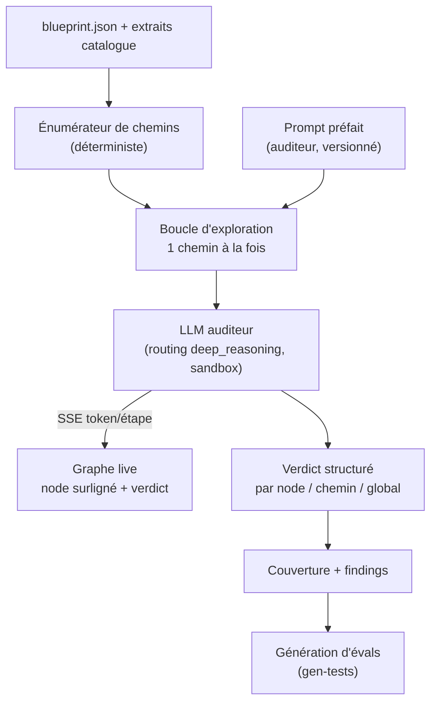

# Spec — Mode Test LLM : explorateur de chemins en direct

Date : 2026-07-08. Portée : un mode « test » qui fait **parcourir tous les
chemins du blueprint par un LLM**, avec un prompt préfait, visualisable en
direct sur le graphe. Répond au besoin : valider un flow via LLM avant de le
compiler et de le lâcher à l'hôte.

Enchaîne sur les trois specs précédents : il explore les chemins `happy`,
`failure` et `escalation` (typage d'edge), traverse les `Gate` (leurs branches
de rejet), et **génère des cas d'éval** à partir de ses trouvailles.

---

## 0. La ligne rouge — auditer, pas exécuter

L'invariant est non négociable : le blueprint **n'exécute jamais**. Un « mode
test qui fait tourner le flow » le violerait. La conception résout la tension
par une distinction nette :

> L'explorateur est un **auditeur** (LLM-as-judge) qui **raisonne sur le graphe
> déclaratif**. Il ne lance aucun agent compilé, n'appelle aucun outil, aucun
> MCP, ne touche pas au filesystem. Sa sortie est une **hypothèse de revue**,
> explicitement étiquetée « non exécuté ».

C'est la même catégorie que les dormants `code-review` et `bug-finder` (jugement
sur un artefact statique), appliquée au graphe au lieu du diff. Le LLM lit le
`.blueprint.json` + des extraits de catalogue, et *raisonne* : « à ce node,
étant donné le contrat entrant, qu'est-ce qui devrait sortir ? le contrat
suivant est-il satisfait ? que peut-il rater ? une porte manque-t-elle ? »

**Alternative rejetée** : faire jouer aux vrais agents compilés un dry-run.
Cela reviendrait à exécuter — donc hors invariant. Si un jour on veut du
comportement réel, c'est le rôle des **évals** (spec 2), exécutées par l'hôte,
pas par le Studio. L'explorateur occupe la case intermédiaire : plus riche que
le lint statique, plus rapide et sans risque qu'une exécution réelle.

### Trois niveaux de validation, désormais complets

| Niveau | Prouve | Qui exécute | Coût |
|---|---|---|---|
| Lint + simulation topologique | La forme (contrats, ordre, portes) | Personne (déterministe) | Nul |
| **Mode Test LLM (ce spec)** | La cohérence de bout en bout, sur tous les chemins | Un LLM auditeur (sandbox) | Un appel LLM borné |
| Évals (spec 2) | Le comportement réel des artefacts | L'hôte (CI, orchestrateur) | Exécution réelle |

L'explorateur est le chaînon manquant entre « le graphe est bien typé » et
« les agents se comportent bien ».

---

## 1. Architecture



### 1.1 Énumérateur de chemins (déterministe, gratuit)

Depuis le graphe, énumérer les chemins des sources vers les puits, **par
canal**. Grâce au typage d'edge, l'énumération couvre :

- Les chemins `happy` (nominal).
- Les chemins `failure` (retry épuisé → fallback).
- Les chemins `escalation` (→ `Gate(human)` / signal ALERT).
- Les branches de `Route` (chaque sortie typée).
- Les branches de rejet de chaque `Gate` (spec précédent).

Bornage : le graphe est un DAG hors boucles ; les `Boundary(loop)` et
`resilience.retry` sont bornés (`max`), donc l'énumération termine. Un plafond
`maxPaths` protège les très gros flows (au-delà : échantillonnage des chemins
les plus critiques — ceux qui touchent une sortie effectful).

### 1.2 Boucle d'exploration

Pour chaque chemin, une passe LLM indépendante (contexte isolé — cf. ingénierie
de contexte 4.C : chaque chemin est un sous-agent quarantiné). Le LLM reçoit :
le prompt préfait, le sous-graphe du chemin, les fiches catalogue des patterns
traversés (relations, anti-patterns). Il **ne voit pas** les autres chemins :
isolation = verdicts non contaminés + parallélisable.

### 1.3 Vue live

Réutilise l'infra SSE existante (`/api/events`). À mesure que le LLM raisonne,
il émet des événements qui surlignent le node courant et tracent le chemin sur
le graphe — le « voir en live » demandé. Le reviewer regarde l'auditeur
*marcher* le flow, node après node, verdict après verdict.

---

## 2. Le prompt préfait (versionné)

Un system prompt fixe, versionné avec le Studio (comme un artefact : diffable,
hash tracé). Squelette :

```text
Tu es un AUDITEUR de blueprint agentique. Tu n'EXÉCUTES rien : tu raisonnes sur
un graphe déclaratif. Interdiction absolue d'appeler un outil, un MCP, ou de
supposer un accès disque/réseau.

On te donne UN chemin d'un flow (canal: happy|failure|escalation), les fiches
des patterns traversés, et les contrats aux frontières.

Pour CHAQUE node du chemin, dans l'ordre, produis un objet JSON :
  - node: id
  - incoming: contrat(s) reçu(s)
  - expected_output: ce que ce node DEVRAIT produire (hypothèse, 1 phrase)
  - contract_satisfied: bool — la sortie satisfait-elle le pin suivant ?
  - risks: [ {class, detail} ]  # timeout, contract-violation, guardrail-block,
                                # budget, refusal, missing-gate, anti-pattern
  - citations: [ relation ou anti-pattern du catalogue justifiant un risque ]

Puis un verdict de chemin :
  - verdict: sound | risky | broken
  - rationale: 2 phrases max
  - missing: [ portes/guardrails/gates manquants sur ce chemin ]

Règles de jugement :
  - Toute sortie effectful (réseau/écriture) SANS Gate(guardrail) ou Gate(human)
    en amont = risk missing-gate, verdict au moins risky.
  - Tout node externe (mcp/extension) SANS Gate(mcp-trust) en amont = broken.
  - Un chemin failure/escalation qui reboucle vers le plan happy = broken.
  - Cite une relation (parmi les 141) ou un anti-pattern (parmi les 52) pour
    chaque risque — pas d'opinion sans source. Si aucune source, dis-le.

Étiquette toujours ta sortie : HYPOTHÈSE — non exécuté.
```

Le prompt est **ancré dans le corpus normatif** (141 relations, 52
anti-patterns exportés) : l'auditeur matérialise le catalogue, il n'émet pas
une opinion. Même thèse que l'assist « pourquoi » du brainstorm 1, appliquée à
l'exploration complète.

---

## 3. Protocole de streaming (SSE)

Événements émis sur `/api/blueprints/{id}/explore` (SSE), consommés par le
graphe :

| Événement | Charge | Effet UI |
|---|---|---|
| `run-start` | `{paths: n, mode}` | Barre de progression, liste des chemins |
| `path-start` | `{pathId, channel, nodes: []}` | Trace le chemin en surbrillance douce |
| `node-enter` | `{pathId, nodeId}` | Node courant animé (pulse) |
| `node-verdict` | `{nodeId, contract_satisfied, risks}` | Badge sur le node (vert/orange/rouge) |
| `path-verdict` | `{pathId, verdict, missing}` | Couleur finale du chemin |
| `run-complete` | `{coverage, findings}` | Rapport agrégé |

L'infra SSE existe déjà (le replay temporel du brainstorm XXL branche déjà
l'onglet SIMU sur `/api/events`) : le mode test réutilise le même canal, avec
une source d'événements « explorer » au lieu de « events.jsonl ».

---

## 4. Sortie structurée + couverture

- **Par node** : contrat satisfait, risques cités.
- **Par chemin** : verdict `sound|risky|broken` + portes manquantes.
- **Agrégat** :
  - **Couverture** : quels nodes / edges ont été visités sur l'ensemble des
    chemins (un node jamais visité = code mort du flow — jonction avec le
    dormant `dark-matter`).
  - **Findings** classés par sévérité, dédupliqués entre chemins.

La sortie ne s'écrit pas dans le `.blueprint.json` (c'est une revue, pas une
partie du flow) : sidecar `.github/prompts/{id}.explore.jsonl`, lu par le
panneau santé.

---

## 5. Boucle de rétroaction vers les évals

C'est ce qui rend le mode test *productif* plutôt que consultatif : chaque
finding se **promeut en cas d'éval** (spec 2), via le dormant `gen-tests`.

| Finding de l'explorateur | Cas d'éval généré |
|---|---|
| « chemin escalation atteint depuis un timeout crew-recherche » | `injectFailure: timeout` + `path-taken: [crew-recherche, escalade]` |
| « sortie réseau sans guardrail » | `guardrail-pass` sur la sortie |
| « coût cumulé du chemin happy élevé » | `cost-under: <seuil>` |
| « node evidence peut recevoir un handoff vide » | `contract-holds` sur le pin d'entrée |

L'auditeur trouve *où* regarder (rapide, exhaustif sur les chemins) ; les évals
prouvent *que ça tient* (lent, réel, exécuté par l'hôte). L'un alimente
l'autre — la boucle se referme.

---

## 6. Garde-fous invariant

- **Sandbox** : aucun outil, MCP, accès disque/réseau exposé à l'auditeur. Il ne
  reçoit que du texte (blueprint + fiches). Techniquement : appel LLM nu, sans
  tool-calling activé.
- **Étiquetage** : toute sortie porte « HYPOTHÈSE — non exécuté ». Le panneau
  santé ne confond jamais un verdict d'auditeur avec un résultat d'éval.
- **Routing modèle** : profil `deep_reasoning` (revue critique = la politique de
  routing du projet l'impose déjà pour la cross-validation).
- **Budget propre** : l'exploration est *elle-même* un coût LLM → un
  `Gate(budget)` interne borne le nombre de chemins × tokens. Un gros flow ne
  déclenche pas une facture surprise (mode `quick` par défaut, §7).
- **Déterminisme raisonnable** : température basse ; le verdict n'a pas besoin
  d'être byte-identique (ce n'est pas un artefact compilé), mais stable en
  classe (`sound|risky|broken`).

---

## 7. Modes d'exécution

| Mode | Chemins explorés | Usage |
|---|---|---|
| `quick` (défaut) | Chemins happy uniquement | Vérif rapide en cours d'édition |
| `full` | happy + failure + escalation + branches de gate/route | Avant compilation / avant PR |
| `targeted` | Un chemin choisi à la souris | Déboguer un chemin précis en live |

Le mode `full` est le candidat naturel à brancher sur un hook `PreCompile` ou
sur la CI (revue de flow automatique en PR), en `shadow` d'abord (canal Labs).

---

## 8. Surface technique

- Kit : `blueprint_explore(blueprint, mode) -> stream` dans `forge_server` +
  route SSE `GET /api/blueprints/{id}/explore?mode=full`.
- Énumérateur de chemins : fonction pure sur le graphe (réutilise l'ordre
  topologique de `blueprint_simulate`, étendu aux canaux failure/escalation).
- Prompt : artefact versionné `.github/prompts/_explorer-auditeur.prompt.md`
  (hash tracé, diffable).
- UI : onglet TEST (à côté de SIMU), consomme le SSE, surligne le graphe,
  affiche le rapport + le bouton « générer les évals » (→ `gen-tests`).

---

## 9. Impact sur le plan

Nouveau chantier, à insérer en **Phase 3** (anticipation & observation) du
raffinement, entre la simulation à données (P3.1) et le replay SSE (P3.3) :

| # | Chantier | Dépend de | Livrable | Preuve |
|---|---|---|---|---|
| P3.5 | Mode Test LLM | P0.2 (canaux), P2.1 (gates), infra SSE | Énumérateur + prompt auditeur + onglet TEST live | Un flow `risky` détecté et son finding promu en cas d'éval qui, exécuté, échoue puis passe après fix |

Réveils dormants mobilisés : `gen-tests` (génération d'évals), `dark-matter`
(nodes jamais visités = code mort du flow), `code-review`/`bug-finder`
(catégorie LLM-as-judge de référence).

Chacun via le canal Labs, une PR chacun.
