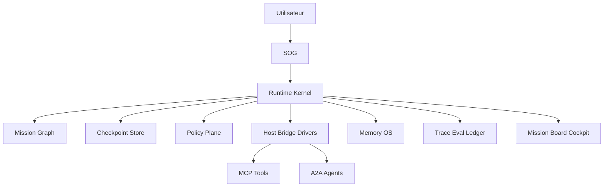

# Formule - Agent OS Grimoire

## Thèse

Grimoire doit devenir le système d'exploitation local des agents de développement.

Un OS agentique n'est pas une collection d'agents. C'est une couche de contrôle qui donne aux agents :

- une identité ;
- des capacités déclarées ;
- des permissions ;
- une mémoire ;
- un état de run ;
- des tools ;
- des preuves ;
- une interface opérateur.

## Formule produit

```text
Agent OS = Kernel + Drivers + Memory + Scheduler + Policy + Telemetry + Shell
```

Pour Grimoire :

```text
Grimoire Agent OS =
  Grimoire Runtime Kernel
+ Host Bridge Drivers
+ Memory OS
+ Mission Scheduler
+ Policy and Guardrails Plane
+ Trace and Eval Ledger
+ Mission Board Cockpit
+ Pack Registry
```

## Les huit primitives du kernel

### 1. Run

Un `Run` est une exécution complète reliée à une intention utilisateur.

Champs minimaux :

```yaml
run_id: string
mission_id: string
workflow_id: string
state: queued|running|blocked|review|completed|failed|cancelled
started_at: string
closed_at: string|null
owner: string
policy_profile: string
trace_id: string
```

### 2. Mission

Une `Mission` porte le contrat utilisateur :

- objectif ;
- périmètre ;
- exclusions ;
- livrables ;
- preuves ;
- risques ;
- approbations.

### 3. Task

Une `Task` est l'unité routable :

- agent cible ;
- capability requise ;
- inputs ;
- outputs ;
- blockers ;
- evidence refs ;
- memory refs ;
- status.

### 4. Event

Un `RunEvent` remplace progressivement le modèle hook-centric.

```yaml
event_id: string
run_id: string
mission_id: string
task_id: string|null
parent_event_id: string|null
span_id: string
type: string
phase: start|end|block|correct|info|approve|deny
actor:
  kind: human|agent|tool|host|system
  id: string
policy:
  decision: allow|deny|ask|shadow|canary
  reason: string|null
evidence_refs: []
payload: {}
```

### 5. Checkpoint

Un `Checkpoint` rend le run reprenable :

- état sérialisé ;
- dernier événement appliqué ;
- effets externes enregistrés ;
- side effects idempotents ;
- approval pending ;
- reprise possible.

### 6. Capability Manifest

Chaque agent, skill, host et tool publie ses capacités.

```yaml
capability:
  id: string
  kind: agent|skill|tool|host|workflow
  inputs: []
  outputs: []
  permissions: []
  risk_level: read|write|execute|external
  evidence_profile: string
  owner: string
```

### 7. Policy Verdict

Chaque action sensible produit un verdict :

- autorisé ;
- refusé ;
- demande validation ;
- exécuté en shadow ;
- exécuté en canary.

### 8. Evidence Pack

Un `EvidencePack` ferme une mission :

- artefacts ;
- tests ;
- logs ;
- traces ;
- décisions ;
- risques restants ;
- verdict final.

## Architecture cible



## Ce qui rend Grimoire différent

### IDE-native

Grimoire vit dans le workspace réel. Il comprend :

- `.github/agents` ;
- `.github/skills` ;
- hooks ;
- MCP local ;
- VS Code ;
- tests ;
- fichiers ;
- runtime Game UI.

### Opérable

Le cockpit n'est pas un dashboard générique. Il doit permettre :

- observer ;
- inspecter ;
- challenger ;
- approuver ;
- reprendre ;
- clôturer ;
- auditer.

### Méthode plus runtime

Grimoire ne sépare pas la méthode de travail et le système. C'est un avantage, à condition de ne pas laisser la méthode gonfler le kernel.

## Règle de sobriété

Une primitive entre dans le kernel seulement si elle est :

- nécessaire à plusieurs workflows ;
- testable ;
- sérialisable ;
- observable ;
- versionnable ;
- utile sans UI ;
- indépendante d'un fournisseur.

Sinon, elle reste dans un pack, une skill, un adapter ou l'incubateur.

## Ambitions utiles

### A2A Gateway

Créer un adapter qui publie Grimoire comme agent A2A :

- `/.well-known/agent-card.json` ;
- skills déclarées ;
- tasks ;
- artifacts ;
- auth ;
- scopes ;
- policy ;
- trace refs.

### OTel GenAI Exporter

Mapper les `RunEvent` vers :

- agent spans ;
- model spans ;
- tool spans ;
- MCP spans ;
- metrics ;
- exceptions.

### Memory OS Graph

Relier :

- tasks ;
- agents ;
- files ;
- symbols ;
- tests ;
- decisions ;
- evidence ;
- incidents ;
- memories.

### Skill Supply Chain

Chaque skill doit avoir :

- manifest ;
- permissions ;
- provenance ;
- checksum ;
- propriétaire ;
- tests ;
- scanner sécurité ;
- gate de promotion.

### Sandbox Leases

Chaque action risquée obtient un bail :

- workspace ;
- filesystem scope ;
- network scope ;
- process scope ;
- expiration ;
- cleanup ;
- audit.

## Règle finale

Grimoire doit être plus strict que ses agents.

Un agent peut proposer. Le kernel décide si l'action existe, si elle est autorisée, si elle est reprise possible, si elle produit une preuve, et si elle mérite d'entrer en mémoire.

