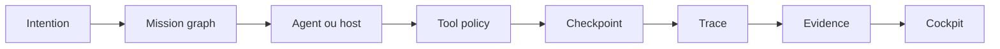

# Guide d'utilisation - Stratégie Grimoire Agent OS

## Lecture recommandée

1. Lire `MATRICE-comparaison-grimoire-vs-references.md` pour comprendre l'écart réel.
2. Lire `FORMULE-agent-os-grimoire.md` pour figer la thèse produit.
3. Lire `PLAN-montee-en-puissance-grimoire-kit.md` pour transformer la thèse en exécution.
4. Lire `REVUE-critique-angles-morts.md` avant de lancer une vague, afin de ne pas reproduire les angles morts déjà visibles.

## Comment s'en servir

Utilise ce paquet comme filtre de décision.

Quand une idée nouvelle arrive, pose trois questions :

- Est-ce que cela renforce le Runtime Kernel ?
- Est-ce que cela rend une mission plus observable, reprenable ou prouvable ?
- Est-ce que cela réduit le risque ou l'ambiguïté, au lieu d'ajouter seulement une nouvelle surface ?

Si la réponse est non, l'idée reste en incubateur.

## Ordre de décision

| Décision | Fichier à utiliser |
| --- | --- |
| Choisir le positionnement produit | `FORMULE-agent-os-grimoire.md` |
| Arbitrer une feature agentique | `MATRICE-comparaison-grimoire-vs-references.md` |
| Lancer un paquet d'exécution | `PLAN-montee-en-puissance-grimoire-kit.md` |
| Sécuriser la feature | `REVUE-critique-angles-morts.md` |
| Justifier une décision externe | `DOC-TECHNIQUE-strategie-grimoire-agent-os.md` |

## Gates avant exécution

Avant de transformer une section du plan en tickets :

- Relancer le comptage agents, skills, hooks et tests.
- Relancer les tests ciblés du runtime concerné.
- Relancer `grimoire doctor`.
- Relancer le rapport MCP policy.
- Vérifier que le paquet de sortie contient un `DOC-TECHNIQUE` et un `GUIDE-utilisation`.
- Vérifier que la vague n'ajoute pas une source de vérité parallèle.

## Règle de gouvernance

Toute nouvelle capacité Grimoire doit choisir une seule catégorie :

| Catégorie | Critère |
| --- | --- |
| Kernel | Primitive runtime stable, testée, versionnée. |
| Projection | Vue UI ou rapport lisant un contrat existant. |
| Adapter | Pont vers host, MCP, A2A, IDE ou outil externe. |
| Pack | Distribution d'agents, skills, workflows, guardrails. |
| Incubateur | Idée non encore prouvée par tests et traces. |

Une capacité qui ne rentre pas clairement dans une catégorie doit être reformulée.

## Résultat attendu

Après application du plan, Grimoire doit pouvoir démontrer une mission complète :

La démonstration doit se lire sans transcript brut et sans promesse narrative.

