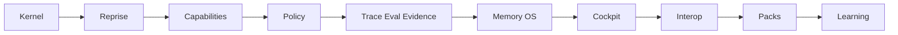

# Plan - Monter Grimoire et grimoire-kit au plus haut

## Principe directeur

Ne pas ajouter une nouvelle couche spectaculaire avant de rendre le noyau plus vrai.

Le plan suit cet ordre :

1. Canoniser le runtime.
2. Rendre les runs reprenables.
3. Déclarer les capacités.
4. Fermer les policies.
5. Brancher mémoire, traces et preuves.
6. Productiser le cockpit.
7. Ouvrir l'interop.
8. Distribuer sous forme de packs gouvernés.

## Vague A - Runtime Kernel v1

### Objectif

Transformer le ledger hook actuel en noyau de run.

### Actions

- Renommer conceptuellement `HookEvent` en sous-type de `RunEvent`.
- Ajouter `run_id`, `mission_id`, `task_id`, `parent_event_id`, `span_id`, `attempt`, `idempotency_key`.
- Définir `RunState` et `Checkpoint`.
- Créer un JSON Schema source de vérité générant Python et TypeScript.
- Ajouter migration additive depuis `activity.jsonl`.
- Ajouter une commande de vérification du ledger.

### Gate

- Un run peut être reconstruit depuis le ledger.
- Un événement incomplet est refusé ou quarantiné selon policy.
- Les tests de contrat Python et TypeScript lisent le même schéma généré.

## Vague B - Mission Graph et reprise

### Objectif

Donner à Grimoire l'équivalent conceptuel des checkpoints et de la reprise durable.

### Actions

- Définir `MissionGraph` : nodes, edges, gates, retries, approvals.
- Stocker le graphe par mission.
- Ajouter `checkpoint write`, `checkpoint inspect`, `checkpoint resume`.
- Encapsuler les side effects dans des tasks idempotentes.
- Rendre HITL reprenable : approval pending puis resume.
- Brancher Mission Board sur `RunState`, pas seulement sur événements isolés.

### Gate

- Une mission interrompue peut reprendre sans rejouer les side effects déjà validés.
- Le cockpit montre l'état bloqué, l'approbation attendue et la reprise possible.

## Vague C - Capability Registry et Agent Cards

### Objectif

Transformer agents, skills, tools, hosts et workflows en capacités déclarées.

### Actions

- Créer `capability.schema.json`.
- Générer un inventaire depuis `.github/agents`, `.github/skills`, MCP, hooks et workflows.
- Ajouter permissions, risk level, evidence profile, input/output contracts.
- Publier une projection A2A `AgentCard` pour Grimoire.
- Ajouter un `Capability Resolver` utilisé par SOG avant dispatch.

### Gate

- Toute délégation SOG référence une capacité connue.
- Toute capacité sensible déclare ses permissions.
- L'AgentCard Grimoire ne contient aucun secret et reflète seulement les capacités publiables.

## Vague D - Policy Plane fail-closed

### Objectif

Faire passer les guardrails de "scripts et diagnostics" à "plan de contrôle".

### Actions

- Étendre `_grimoire-runtime/_config/mcp-policy.yaml`.
- Corriger `ollama` : pas de secret en clair, statut explicite loopback ou allowlist locale.
- Ajouter verdicts de policy dans `RunEvent`.
- Aligner hooks, MCP, dispatch Mission Board et Host Bridge sur les mêmes verdicts.
- Ajouter scanner de skills inspiré OWASP Agentic Skills Top 10.
- Ajouter SBOM ou manifest de pack pour skills et hooks.

### Gate

- Aucun serveur MCP non classé ne passe en silence.
- Un dispatch Mission Board échoue de façon contrôlée si la policy refuse.
- Toute skill nouvelle a manifest, permissions, checksum et test minimal.

## Vague E - Trace, eval et evidence ledger

### Objectif

Transformer observability en chaîne de preuve.

### Actions

- Mapper `RunEvent` vers OTel GenAI : agent span, model span, tool span, MCP span.
- Ajouter un exporter local JSONL et un exporter optionnel externe.
- Relier evaluator, trust scorer et evidence pack au même `run_id`.
- Ajouter datasets de régression par mission type.
- Ajouter `proof profile` par type de tâche.
- Afficher dans cockpit : trace, eval, evidence, verdict.

### Gate

- Une mission complétée a un evidence pack.
- Une évaluation peut remonter à la trace, au task id, à l'agent et aux artefacts.
- Le cockpit explique un refus sans transcript brut.

## Vague F - Memory OS opérationnel

### Objectif

Faire passer Memory OS de statut partiel à source de contexte gouvernée.

### Actions

- Promouvoir les événements importants en mémoire avec provenance.
- Créer `task memory` : chaque carte devient un noeud mémoire.
- Construire `code graph` minimal : fichiers, symboles, tests, contrats.
- Relier task, file, symbol, evidence, decision, incident.
- Ajouter règles de promotion et invalidation.
- Ajouter evals de recall : précision, staleness, provenance, contradictions.

### Gate

- Une tâche similaire retrouve ses décisions et preuves antérieures.
- Une mémoire sans provenance ne peut pas alimenter une décision critique.
- Le cockpit montre les souvenirs lus et leur fraîcheur.

## Vague G - Cockpit opérateur produit

### Objectif

Faire du Mission Board et du Cockpit la surface principale de contrôle.

### Actions

- Brancher toutes les rooms sur `Runtime Kernel`.
- Désactiver les mocks par défaut.
- Ajouter mode `operator review` : inspecter, approuver, refuser, reprendre.
- Ajouter mode `replay lab` : rejouer un run et comparer deux versions.
- Ajouter vue Memory OS : tâche, voisinage sémantique, preuves, contradictions.
- Ajouter vue policy : tools, MCP, skills, hosts, verdicts.

### Gate

- Un opérateur peut fermer une mission depuis le cockpit avec preuves.
- Toute room affiche une donnée kernel ou s'identifie comme démo.
- La surface ne contient pas de logique métier parallèle.

## Vague H - Interop externe contrôlée

### Objectif

Ouvrir Grimoire sans perdre la gouvernance locale.

### Actions

- A2A Gateway : AgentCard, message/send, tasks/get, artifacts.
- MCP Gateway : policy, auth, server classification, secrets via env.
- Host Bridge : Codex, Copilot, Claude, local shell, browser, Playwright.
- Adapter sandbox : lease par action risquée.
- Provider model resolver : capacités de modèles, coût, contexte, disponibilité.

### Gate

- Un agent externe peut découvrir Grimoire sans voir l'état interne non publié.
- Une délégation externe est tracée, policy-checkée et evidence-linkée.
- Les secrets ne sont pas stockés dans les manifests.

## Vague I - Pack Registry et distribution

### Objectif

Faire de Grimoire un produit extensible.

### Actions

- Définir `grimoire-pack.yaml`.
- Packager agents, skills, workflows, hooks, evals, docs, assets.
- Ajouter registry local et remote.
- Ajouter signatures et provenance.
- Ajouter compatibilité version kernel.
- Ajouter tests de pack et scanner sécurité.

### Gate

- Un pack peut être installé, validé, désinstallé.
- Un pack non compatible ou non signé est refusé ou isolé.
- Les packs n'ajoutent pas de source de vérité parallèle.

## Vague J - Learning loop contrôlée

### Objectif

Autoriser l'amélioration automatique seulement sous preuve.

### Actions

- Créer `proposal` pour toute auto-modification.
- Evaluer chaque proposition sur datasets.
- Promouvoir seulement si score et policy passent.
- Stocker les échecs dans failure museum.
- Créer rollback par pack et par capability.

### Gate

- Aucun self-improvement n'est appliqué sans preuve.
- Toute évolution peut être revert via pack ou capability version.
- Le cockpit expose les propositions acceptées et rejetées.

## Ordre strict

## Indicateurs de sortie

| Indicateur | Cible qualitative |
| --- | --- |
| Run reconstructible | Le run se reconstruit depuis ledger et checkpoints. |
| Dispatch borné | Chaque dispatch référence une capability et un policy verdict. |
| MCP fermé | Aucun serveur non classé ou secret en clair ne passe. |
| Evidence pack | Chaque mission critique ferme sur preuves liées à trace. |
| Memory recall | Toute mémoire critique a provenance et fraîcheur. |
| Cockpit réel | Les surfaces lisent le kernel, pas des mocks. |
| Interop contrôlée | A2A/MCP/Host Bridge publient seulement des contrats validés. |
| Packs gouvernés | Skills, hooks et agents s'installent avec provenance et tests. |

