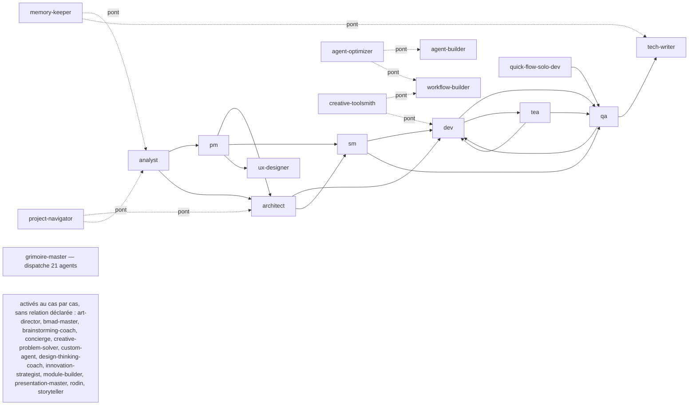

# Carte des agents

Le projet porte deux piles d'agents sur deux hôtes. La carte ci-dessous est générée
depuis les fichiers d'agents eux-mêmes par `scripts/agent-index.py` — elle ne peut pas
mentir sur qui existe. Un agent qui cherche à qui passer la main la lit ici.

Référencée depuis `.github/copilot-instructions.md` (section « Références et structure »).
Régénérer avec `python3 scripts/agent-index.py` ; `--check` échoue si la carte a dérivé
des fichiers d'agents réels.

<!-- agent-index:start — généré par scripts/agent-index.py, ne pas éditer à la main -->

Carte générée depuis les fichiers d'agents eux-mêmes : 23 sur la pile BMM,
7 sur la pile kit. Régénérer avec `python3 scripts/agent-index.py`.

### Pile BMM — `_grimoire-runtime/`, exposée à Copilot

| Agent | Persona | Rôle | Outils | Passe la main à | Visible utilisateur |
|---|---|---|---|---|---|
| `agent-builder` | Bond | Agent Builder — create, validate, edit Grimoire agents. Supports dynamic agent creation for the SOG… | read, edit, search | — | non |
| `analyst` | Mary | Business Analyst sub-agent | read, search | `pm`, `architect` | non |
| `architect` | Winston | Architect sub-agent | read, edit, search | `dev`, `sm` | non |
| `art-director` | Iris | Art Director — direction artistique pixel, hero FX, room kits, palette governance | read, edit, search | — | non |
| `bmad-master` | — | Alias de compatibilité pour grimoire-master. Utilisé quand d'anciennes sessions VS Code référencent encore… | 143 outils — surface hôte complète | — | non |
| `brainstorming-coach` | Carson | Brainstorming Coach — brainstorming sessions, creative techniques, idea generation | read, search | — | non |
| `creative-problem-solver` | Dr. Quinn | Creative Problem Solver — systematic problem solving, TRIZ, root cause analysis, Theory of Constraints | read, search | — | non |
| `design-thinking-coach` | Maya | Design Thinking Coach — human-centered design, empathy mapping, prototyping | read, search | — | non |
| `dev` | Amelia | Developer — implémentation, TDD, coding, refactoring, bug fix | read, edit, search, execute | `qa`, `tea` | non |
| `grimoire-master` | Grimoire Master | Grimoire Orchestrator — Smart Orchestrator Gateway (SOG BM-53). Point d'entrée unique utilisateur. Analyse… | 143 outils — surface hôte complète | — | oui |
| `innovation-strategist` | Victor | Innovation Strategist — disruptive innovation, business model, Blue Ocean, Jobs-to-be-Done | read, search | — | non |
| `module-builder` | Morgan | Module Builder — create, configure, validate Grimoire modules | read, edit, search | — | non |
| `pm` | John | Product Manager — PRD, product brief, prioritisation, roadmap | read, edit, search | `architect`, `sm`, `ux-designer` | non |
| `presentation-master` | Caravaggio | Presentation Master — visual communication, slides, pitch decks | read, edit, search | — | non |
| `qa` | Quinn | QA Engineer — tests, quality assurance, test plans, test automation | read, edit, search, execute | `dev`, `tech-writer` | non |
| `quick-flow-solo-dev` | Barry | Quick Flow Solo Dev — rapid spec + implementation | read, edit, search, execute | `qa` | non |
| `rodin` | Rodin | Rodin — Sparring Partner Intellectuel. Débats socratiques, anti-chambre d'écho, steelmanning, philosophie… | read, edit, search | — | non |
| `sm` | Bob | Scrum Master — sprint planning, backlog, stories, retrospective | read, edit, search | `dev`, `qa` | non |
| `storyteller` | Sophia | Storyteller — narrative strategy, brand storytelling, content creation | read, search | — | non |
| `tea` | Murat | Test Architect — risk-based testing, fixture architecture, ATDD, CI governance, scalable quality gates | read, search, execute | `dev`, `qa` | non |
| `tech-writer` | Paige | Technical Writer — documentation, rédaction technique, standards doc, review éditoriale. Supports dynamic… | read, edit, search | — | non |
| `ux-designer` | Sally | UX Designer — design UX/UI, wireframes, user flows, personas, accessibility | read, search | — | non |
| `workflow-builder` | Wendy | Workflow Builder — create, edit, validate Grimoire workflows. Supports dynamic workflow creation for the SOG… | read, edit, search | — | non |

### Pile kit — `_grimoire/kit/`, exposée à Claude Code

Ces fichiers sont régénérés par `grimoire host sync` : ils ne peuvent pas
déclarer de relation. Leurs liens vers la pile BMM sont déclarés dans
`_grimoire-runtime/_config/agent-bridges.yaml`.

| Agent | Rôle | Outils | Pont vers la pile BMM |
|---|---|---|---|
| `agent-optimizer` | Agent Quality Assurance & Optimizer — Sentinel | Read, Glob, Grep, Edit, Write, Bash | `agent-builder`, `workflow-builder` |
| `art-director` | Art Director — Visual identity, prompt aesthetics, output formatting | Read, Glob, Grep, Edit, Write, Bash | — |
| `concierge` | Concierge — Triage, clarification, routage intelligent vers l'agent adapté | Read, Glob, Grep, Edit, Write, Bash | — |
| `creative-toolsmith` | Creative Toolsmith — Tool design, framework extension, automation patterns | Read, Glob, Grep, Edit, Write, Bash | `workflow-builder`, `dev` |
| `custom-agent` | {{agent_role}} — {{agent_name}} | Read, Glob, Grep, Edit, Write, Bash | — |
| `memory-keeper` | Memory Keeper & Knowledge Quality — Mnemo | Read, Glob, Grep, Edit, Write, Bash | `analyst`, `tech-writer` |
| `project-navigator` | Project Knowledge Curator & Navigator — Atlas | Read, Glob, Grep, Edit, Write, Bash | `architect`, `analyst` |

### Ce que `grimoire-master` sait dispatcher

Son frontmatter déclare 21 agents. Les agents de la pile BMM
qu'il ne nomme pas ne lui sont pas accessibles par dispatch :

- hors roster : `bmad-master`

### Doublons entre piles

| Noms | Piles | Arbitrage |
|---|---|---|
| `art-director` / `art-director` | bmm / kit | La version BMM est spécialisée pixel art, hero FX et room kits, et lit grimoire-game-assets/. La version kit est l'archétype générique d'identité visuelle. Sur ce projet, la version BMM prime ; la version kit ne sert que de repli hors contexte jeu. |
| `grimoire-master` / `concierge` | bmm / kit | Même fonction de triage et de routage, et les deux sont désormais chargés en même temps sous Claude Code : le master SOG par l'import de CLAUDE.md, le concierge par le hook SessionStart du kit, qui injecte la persona d'entrée dans la boucle principale (Grimoire-kit#233). Sous Copilot, seul le master SOG est chargé. En cas de désaccord, le master SOG tranche : le concierge apporte le protocole de triage, pas la doctrine d'atelier. |

### Graphe des relations

<!-- agent-index:end -->
