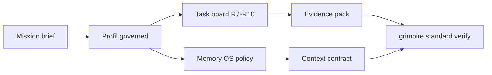

# Grimoire Forge

<section class="hero">
  <p class="eyebrow">Runtime agentique gouverne</p>
  <h1>Forger, verifier et operer un projet agentique de bout en bout.</h1>
  <p>
    Grimoire Forge rassemble les standards, workflows, hooks, skills et contrats runtime
    qui permettent de passer d'une intention produit a une execution agentique gouvernee.
  </p>
</section>

## Surfaces principales

<div class="grid cards" markdown>

-   :material-shield-check-outline: **Profil standard gouverne**

    Le depot declare le profil `governed` dans `_grimoire/standard/standard-profile.yaml`.

-   :material-database-clock-outline: **Memory OS**

    Le contrat memoire vit dans `_grimoire/standard/memory-policy.yaml` et couvre Redis, Weaviate, Neo4j, SQLite et Qdrant legacy.

-   :material-source-branch: **Execution agentique**

    Les taches R7/R8/R9/R10 sont tracees dans `_grimoire/standard/task-board.yaml`.

-   :material-file-check-outline: **Preuves**

    Les preuves bootstrap vivent dans `_grimoire-output/evidence/bootstrap/`.

</div>

## Carte rapide



## Demarrage recommande

1. Verifier le profil avec `grimoire-kit/.venv/bin/grimoire standard verify`.
2. Lire `_grimoire/standard/mission-brief.md`.
3. Inspecter `_grimoire/standard/task-board.yaml`.
4. Mettre a jour `_grimoire-output/evidence/bootstrap/evidence-pack.md` apres chaque changement gouverne.

## Artefacts gouvernes

| Surface | Chemin |
|---|---|
| Profil | `_grimoire/standard/standard-profile.yaml` |
| Mission | `_grimoire/standard/mission-brief.md` |
| Board | `_grimoire/standard/task-board.yaml` |
| Memoire | `_grimoire/standard/memory-policy.yaml` |
| Contexte | `_grimoire/standard/context-contract.yaml` |
| Preuves | `_grimoire-output/evidence/bootstrap/evidence-pack.md` |

## Commandes

```bash
grimoire-kit/.venv/bin/grimoire standard verify
grimoire-kit/.venv/bin/grimoire standard score
grimoire-kit/.venv/bin/grimoire standard context
```
