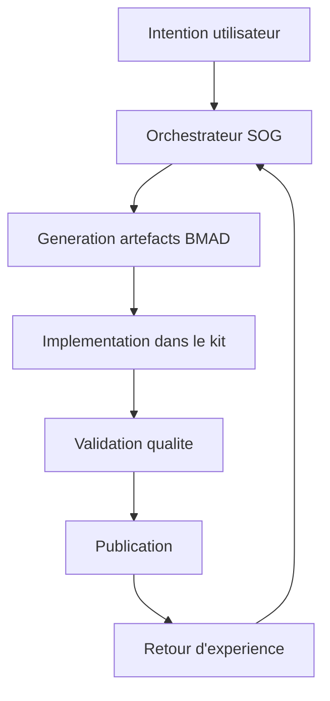

# Objectif Produit - Moteur de Creation de Projets Agentiques

## Vision

Grimoire Forge est un moteur qui permet de generer et operer un projet agentique complet a partir d'une intention produit.

## Probleme adresse

Les equipes perdent du temps a assembler manuellement les memes briques : instructions, workflows, memoire, conventions, tests de gouvernance, et routines de qualite.

## Proposition de valeur

- Initialisation structuree d'un projet agentique.
- Orchestration intelligente de la production d'artefacts.
- Qualite integree: lint, tests, preflight, verification de coherence.
- Boucle d'amelioration continue basee sur la memoire et les signaux d'usage.

## Capacites deja disponibles a capitaliser

- SOG BM-53 pour l'orchestration centralisee.
- UDF pour la creation dynamique d'artefacts.
- ALS, AORA, PIP, DCF pour l'autonomie gouvernee.
- Suite de sante projet: health-check, memory-audit, self-heal, pre-push.

## Architecture cible

## Perimetre

- Definition et generation de structures de projet agentique.
- Outillage de gouvernance et de qualite.
- Documentation standardisee de chaque artefact cle.

## Hors perimetre

- Hebergement proprietaire d'un service cloud dedie.
- Dependance a un unique fournisseur LLM.
- UI lourde obligatoire avant stabilisation du moteur.
